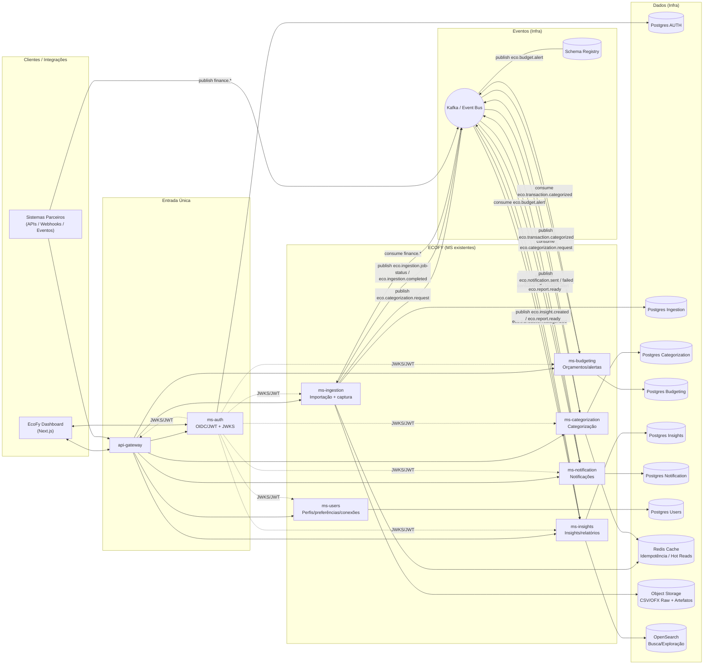

# 🌱 EcoFy — Financial Automation & Data Intelligence Platform  
## 🌱 EcoFy — Plataforma de Automação Financeira e Inteligência de Dados

---

## 📌 Overview | Visão Geral

**EcoFy** is a backend platform based on **event-driven microservices**, designed to **organize, centralize, and transform raw financial data** (bank statements, transactions, and financial events) into **structured, categorized, and actionable information**.

**EcoFy** simulates, in a realistic way, how **fintechs, digital banks, and financial management platforms** process financial data at scale with **security, traceability, and modularity**.

---

O **EcoFy** é uma plataforma backend orientada a **microsserviços e eventos**, projetada para **organizar, centralizar e transformar dados financeiros brutos** (extratos, transações e eventos financeiros) em **informações estruturadas, categorizadas e acionáveis**.

O projeto simula de forma realista como **fintechs, bancos digitais e plataformas de gestão financeira** processam dados financeiros com **escalabilidade, segurança e isolamento de responsabilidades**.

---

## 🎯 What the Platform Does | O que a Plataforma Faz

**EcoFy enables users and integrated systems to:**

- import bank files (CSV / OFX),
- ingest financial events in real time,
- categorize transactions automatically,
- manage budgets and spending limits,
- generate insights, metrics, and reports,
- trigger notifications based on financial events.

---

**O EcoFy permite que usuários ou sistemas integrados:**

- importem arquivos bancários (CSV / OFX),
- enviem eventos financeiros em tempo real,
- categorizem transações automaticamente,
- gerenciem orçamentos e limites de gastos,
- gerem insights, métricas e relatórios,
- disparem notificações baseadas em eventos financeiros.

---

In short:  
**EcoFy transforms unstructured financial data into actionable knowledge.**

Em resumo:  
**O EcoFy transforma dados financeiros desestruturados em conhecimento acionável.**

---

## 🧭 Architecture Overview | Visão Geral da Arquitetura

EcoFy is built on an **event-driven architecture**, using **Kafka as the central event bus**, protected by an **API Gateway** and **OIDC/JWT authentication**.

---

O EcoFy é construído sobre uma **arquitetura orientada a eventos**, utilizando **Kafka como barramento central**, protegido por **API Gateway** e **autenticação OIDC/JWT**.

---

## 🗺️ System Diagram | Diagrama do Sistema

> This diagram represents **only the microservices that exist in this repository**, including their connections to databases, cache, and Kafka.

> Este diagrama representa **apenas os microsserviços existentes neste repositório**, incluindo conexões com bancos, cache e Kafka.

---
# 🧩 Microservices | Microsserviços

## 🔐 api-gateway
*   **EN:** Single HTTP entry point. Routes requests, applies authentication, logging, and rate-limiting.
*   **PT:** Ponto único de entrada HTTP. Responsável por roteamento, autenticação, logging e rate-limit.

## 🔑 ms-auth
*   **EN:** Authentication and authorization service implementing OIDC/JWT, token issuance, validation, and JWKS exposure.
*   **PT:** Serviço de autenticação e autorização com OIDC/JWT, emissão e validação de tokens e JWKS.

## 📥 ms-ingestion
*   **EN:** Responsible for ingesting financial data via CSV/OFX files and Kafka events, managing import jobs, storing raw transactions, and publishing events for categorization.
*   **PT:** Responsável pela ingestão de dados financeiros via arquivos CSV/OFX e eventos Kafka, controle de jobs de importação, persistência de transações brutas e publicação de eventos para categorização.

## 🏷️ ms-categorization
*   **EN:** Automatically categorizes transactions based on rules and heuristics, supports manual categorization, and emits categorization events.
*   **PT:** Realiza a categorização automática de transações com base em regras, suporta categorização manual e publica eventos de categorização.

## 💰 ms-budgeting
*   **EN:** Manages budgets per category, tracks consumption, and triggers budget alerts when limits are exceeded.
*   **PT:** Gerencia orçamentos por categoria, controla consumo e dispara alertas quando limites são ultrapassados.

## 📊 ms-insights
*   **EN:** Generates financial insights, metrics, trends, and reports, providing aggregated data for dashboards.
*   **PT:** Gera insights financeiros, métricas, tendências e relatórios para visualização em dashboards.

## 🔔 ms-notification
*   **EN:** Sends notifications based on domain events (budget alerts, insights), supporting multiple delivery channels.
*   **PT:** Responsável pelo envio de notificações baseadas em eventos do domínio (alertas, insights), com múltiplos canais.

## 👤 ms-users
*   **EN:** Manages financial user profiles, preferences, linked accounts, and integrations with the authentication service.
*   **PT:** Gerencia o perfil financeiro do usuário, preferências, contas vinculadas e integração com o serviço de autenticação.

# 🏗️ Software Architecture | Arquitetura de Software

**EN:**  
All microservices follow Hexagonal Architecture (Ports & Adapters), ensuring low coupling, high testability, and clear separation of concerns.

**PT:**  
Todos os microsserviços seguem Arquitetura Hexagonal (Ports & Adapters), garantindo baixo acoplamento, alta testabilidade e separação clara de responsabilidades.

---

# ⚙️ Technology Stack | Stack Tecnológica

- **Language:** Java 21
- **Framework:** Spring Boot
- **Build Tool:** Maven (entire project)
- **Messaging:** Kafka
- **Database:** PostgreSQL
- **Caching:** Redis
- **Search & Analytics:** OpenSearch
- **Infrastructure:** Docker & Docker Compose

---

# 🐳 Local Execution | Execução Local

**EN:**  
Each microservice has its own Docker Compose, allowing isolated execution, focused testing, and easier debugging.

**PT:**  
Cada microsserviço possui seu próprio Docker Compose, permitindo execução isolada, testes focados e debug facilitado.

---

# 🧪 Tests & Evidence | Testes e Evidências

**EN:**
*   Unit tests focused on domain and application layers.
*   REST endpoint tests.
*   Evidence of executions and test scenarios available in the repository [Wiki](URL_DA_SUA_WIKI).

**PT:**
*   Testes unitários focados no domínio e serviços.
*   Testes de endpoints REST.
*   Evidências de execução e cenários disponíveis na [Wiki do repositório](URL_DA_SUA_WIKI).

---

# 🚀 Project Purpose | Objetivo do Projeto

**EN:**  
EcoFy was built as a professional portfolio project, showcasing real-world backend architecture, event-driven design, and financial domain modeling.

**PT:**  
O EcoFy foi desenvolvido como um projeto de portfólio profissional, demonstrando arquitetura backend realista, design orientado a eventos e modelagem de domínio financeiro.

---

**📌 Status:** continuously evolving | em evolução contínua  
**📖 More details:** see repository [Wiki](URL_DA_SUA_WIKI) | consulte a Wiki do repositório
