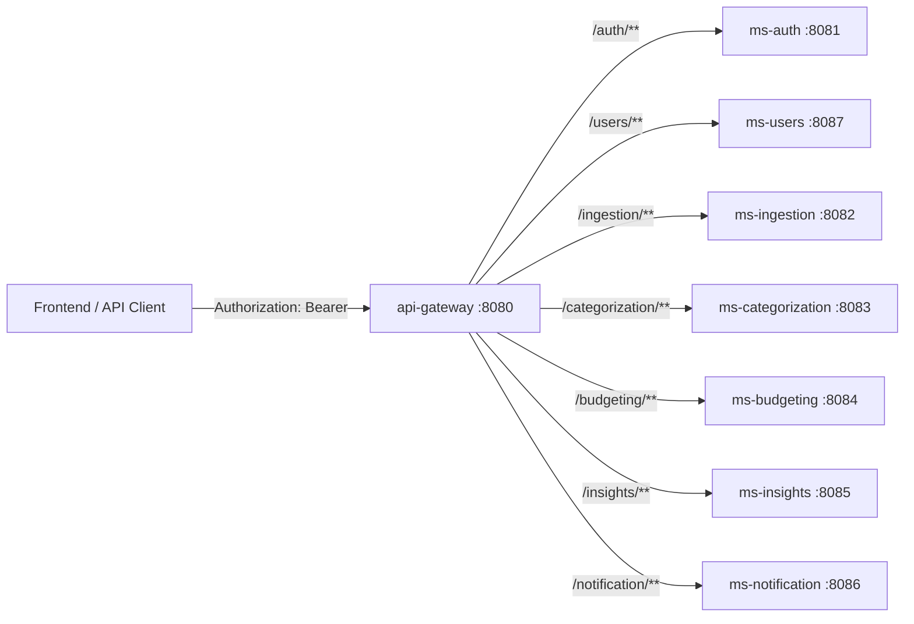

# api-gateway — EcoFy

> Ponto único de entrada HTTP do ecossistema EcoFy: roteamento estático declarativo, filtros, segurança operacional e observabilidade.

> 🇬🇧 **English summary first.**
> 🇧🇷 **Documentação técnica completa em Português abaixo.**

---

## 🇬🇧 English Summary

### Responsibility

The `api-gateway` is the single HTTP entry point for EcoFy.

It receives external requests (frontend / API clients) and routes them to the internal microservices. Its value is in **routing, filters, operational security, observability and documentation** — not business logic.

The gateway does **not** authenticate or authorize. Token validation is delegated to each downstream service (OAuth2 Resource Server); the gateway only guarantees that `Authorization: Bearer <token>` reaches the service intact.

### Technology stack

* Java 25
* Spring Boot 4
* Spring Cloud Gateway (Server WebFlux)
* Spring Boot Actuator
* Maven
* JUnit 5

### Architecture

The gateway is a thin routing layer built on declarative static routes. Each microservice has an `id`, a `uri` (externalized via environment variable with a local fallback) and a `Path` predicate. There is no `StripPrefix`: each route prefix equals the target service `context-path`.

### Service configuration

| Property | Value  |
| -------- | ------ |
| Port     | `8080` |
| Type     | Reactive gateway (WebFlux) |
| Security | Pass-through (no JWT validation) |

Local base URL:

```text
http://localhost:8080
```

### Routing table (port 8080)

| Public prefix        | Route id            | URI (env var)           | Local fallback          |
| -------------------- | ------------------- | ----------------------- | ----------------------- |
| `/auth/**`           | `ms-auth`           | `MS_AUTH_URI`           | `http://localhost:8081` |
| `/ingestion/**`      | `ms-ingestion`      | `MS_INGESTION_URI`      | `http://localhost:8082` |
| `/categorization/**` | `ms-categorization` | `MS_CATEGORIZATION_URI` | `http://localhost:8083` |
| `/budgeting/**`      | `ms-budgeting`      | `MS_BUDGETING_URI`      | `http://localhost:8084` |
| `/insights/**`       | `ms-insights`       | `MS_INSIGHTS_URI`       | `http://localhost:8085` |
| `/notification/**`   | `ms-notification`   | `MS_NOTIFICATION_URI`   | `http://localhost:8086` |
| `/users/**`          | `ms-users`          | `MS_USERS_URI`          | `http://localhost:8087` |

### Security

The gateway is a pass-through: it does **not** validate JWT. `Authorization` is preserved downstream and `Cookie` is stripped. An `X-Gateway` marker is added to every request.

### Actuator

`health`/`info` are exposed in `default`/`prod`; the operational `gateway` endpoint (routes/filters) is exposed **only in `dev`**.

### Known limitations

* No JWT enforcement at the edge (delegated to Resource Servers).
* Dynamic `/services/**` routing was intentionally removed in favor of static routes.
* No rate limiting / circuit breaker yet.

---

# 🇧🇷 Documentação técnica

## 1. Visão geral

O `api-gateway` é o ponto único de entrada HTTP do ecossistema EcoFy.

Ele recebe as requisições externas (frontend / API clients) e as encaminha para os microsserviços internos. Seu valor está em **roteamento, configuração, filtros, segurança operacional, observabilidade e documentação** — não em regra de negócio.

O gateway **não** faz autenticação/autorização. A validação de token (JWT / Resource Server) é responsabilidade de cada microsserviço downstream — o gateway apenas garante que o `Authorization: Bearer <token>` chegue intacto.

---

## 2. Stack tecnológica

| Tecnologia                 | Responsabilidade                      |
| -------------------------- | ------------------------------------- |
| Java 25                    | Linguagem principal                   |
| Spring Boot 4              | Framework da aplicação                |
| Spring Cloud Gateway       | Roteamento reativo (Server WebFlux)   |
| Spring Boot Actuator       | Observabilidade e diagnóstico         |
| Maven Wrapper              | Build e gerenciamento de dependências |
| JUnit 5                    | Testes automatizados                  |

---

## 3. Configuração do serviço

| Configuração | Valor padrão               |
| ------------ | -------------------------- |
| Porta        | `8080`                     |
| Tipo         | Gateway reativo (WebFlux)  |
| Segurança    | Pass-through (sem validar JWT) |

URL base local:

```text
http://localhost:8080
```

---

## 4. Responsabilidade do gateway

* Expor prefixos públicos estáveis (`/auth/**`, `/users/**`, ...).
* Rotear cada prefixo para o microsserviço correspondente.
* Repassar headers relevantes downstream (incluindo `Authorization`).
* Remover cookies do browser antes de chamar os MS (`RemoveRequestHeader=Cookie`).
* Expor endpoints de diagnóstico do Actuator de forma controlada por profile.

---

## 5. Estratégia oficial de roteamento: rotas estáticas

A estratégia oficial é **rotas estáticas declarativas** no `application.yml`. Cada microsserviço tem um `id`, uma `uri` (via variável de ambiente com fallback local) e um predicado de `Path`.

O fluxo dinâmico `/services/{service}/**` foi **removido** — veja a seção [Decisão sobre `/services/**`](#10-decisão-sobre-services).

### Tabela de rotas

| Prefixo público      | id da rota          | URI (env var)           | Fallback local          |
| -------------------- | ------------------- | ----------------------- | ----------------------- |
| `/auth/**`           | `ms-auth`           | `MS_AUTH_URI`           | `http://localhost:8081` |
| `/ingestion/**`      | `ms-ingestion`      | `MS_INGESTION_URI`      | `http://localhost:8082` |
| `/categorization/**` | `ms-categorization` | `MS_CATEGORIZATION_URI` | `http://localhost:8083` |
| `/budgeting/**`      | `ms-budgeting`      | `MS_BUDGETING_URI`      | `http://localhost:8084` |
| `/insights/**`       | `ms-insights`       | `MS_INSIGHTS_URI`       | `http://localhost:8085` |
| `/notification/**`   | `ms-notification`   | `MS_NOTIFICATION_URI`   | `http://localhost:8086` |
| `/users/**`          | `ms-users`          | `MS_USERS_URI`          | `http://localhost:8087` |

> Não há `StripPrefix`: o path é repassado **integralmente** ao downstream.
> Ex.: `GET /auth/login` chega ao `ms-auth` como `GET /auth/login`.

---

## 6. Headers e segurança operacional

* **`Authorization`**: preservado e repassado downstream (não é removido).
* **`Cookie`**: removido antes de chamar o MS (`RemoveRequestHeader=Cookie`).
* **`X-Gateway: api-gateway`**: adicionado a toda requisição, para diagnóstico de origem no downstream.

A validação real do token continua com cada microsserviço (Resource Server).



---

## 7. Profiles e exposição do Actuator

A exposição do Actuator é **conservadora por padrão** e ampliada apenas em `dev`.

| Profile   | Arquivo                | Actuator exposto            | Endpoint `gateway`  | Log level gateway |
| --------- | ---------------------- | --------------------------- | ------------------- | ----------------- |
| `default` | `application.yml`      | `health`, `info`            | ❌ não exposto      | `INFO`            |
| `dev`     | `application-dev.yml`  | `health`, `info`, `gateway` | ✅ acessível        | `DEBUG`           |
| `prod`    | `application-prod.yml` | `health`                    | ❌ (`access: none`) | `WARN`            |

* `health` fica sempre disponível para checagem de disponibilidade.
* O endpoint operacional `gateway` (lista rotas/filtros/predicados) **só** é exposto no profile `dev`, para diagnóstico local. Nunca em produção.

Ativação do profile:

```bash
# dev (diagnóstico local)
SPRING_PROFILES_ACTIVE=dev ./mvnw spring-boot:run

# produção
SPRING_PROFILES_ACTIVE=prod java -jar target/api-gateway-0.0.1-SNAPSHOT.jar
```

---

## 8. Variáveis de ambiente

Todas as URIs de destino são externalizadas com fallback local, permitindo rodar o ecossistema inteiro em `localhost` sem configuração adicional.

| Variável                 | Default                 | Descrição                     |
| ------------------------ | ----------------------- | ----------------------------- |
| `MS_AUTH_URI`            | `http://localhost:8081` | Base URI do `ms-auth`         |
| `MS_INGESTION_URI`       | `http://localhost:8082` | Base URI do `ms-ingestion`    |
| `MS_CATEGORIZATION_URI`  | `http://localhost:8083` | Base URI do `ms-categorization` |
| `MS_BUDGETING_URI`       | `http://localhost:8084` | Base URI do `ms-budgeting`    |
| `MS_INSIGHTS_URI`        | `http://localhost:8085` | Base URI do `ms-insights`     |
| `MS_NOTIFICATION_URI`    | `http://localhost:8086` | Base URI do `ms-notification` |
| `MS_USERS_URI`           | `http://localhost:8087` | Base URI do `ms-users`        |
| `SPRING_PROFILES_ACTIVE` | `default`               | `dev` \| `prod`               |

---

## 9. Exemplos de chamadas

```bash
# Login (ms-auth) — sem token
curl -i http://localhost:8080/auth/api/auth/token -X POST \
     -H "Content-Type: application/json" \
     -d '{"clientId":"eco_dashboard_local","username":"user@ecofy.com","password":"secret"}'

# JWKS (ms-auth)
curl -i http://localhost:8080/auth/.well-known/jwks.json

# Recurso protegido (ms-users) — Authorization é repassado ao downstream
curl -i http://localhost:8080/users/api/users/v1/profile -H "Authorization: Bearer <token>"

# Query string é preservada
curl -i "http://localhost:8080/insights/api/insights/v1/dashboard/{userId}?from=2026-01-01"

# Diagnóstico (apenas profile dev)
curl -i http://localhost:8080/actuator/gateway/routes
curl -i http://localhost:8080/actuator/health
```

---

## 10. Decisão sobre `/services/**`

O projeto continha um fluxo de **roteamento dinâmico** (`/services/{service}/...`) composto por `DynamicServiceRoutingFilter` (um `GlobalFilter`) e `DynamicGatewayProperties` (`gateway.dynamic.services`).

Esse fluxo foi **removido**, porque era **código morto**:

1. Não existia rota `/services/**` no `application.yml`. Em Spring Cloud Gateway, um `GlobalFilter` só executa **após** um `Route` casar via predicado. Sem rota `/services/**`, o filtro nunca entrava no pipeline.
2. `gateway.dynamic.services` nunca foi configurado — o mapa de serviços ficava vazio, então mesmo que o filtro executasse, resolveria `404`.
3. Manter duas estratégias concorrentes (estática + dinâmica) aumentava a ambiguidade sem entregar valor.

**Como reativar o roteamento dinâmico no futuro (se necessário):** criar uma rota explícita com predicado `Path=/services/**`, reintroduzir o `GlobalFilter` (reescrevendo `GATEWAY_REQUEST_URL_ATTR`) e as propriedades, e configurar o mapa:

```yaml
gateway:
  dynamic:
    prefix: /services
    services:
      ms-auth: http://localhost:8081
      ms-users: http://localhost:8087
```

Até lá, a estratégia oficial é **rotas estáticas**.

---

## 11. Execução local

### 11.1 Pré-requisitos

* JDK 25.
* Porta `8080` disponível.
* Microsserviços de destino acessíveis (ou seus fallbacks locais).

### 11.2 Executar com Maven Wrapper

Linux ou macOS:

```bash
./mvnw spring-boot:run
```

Windows:

```powershell
.\mvnw.cmd spring-boot:run
```

### 11.3 Verificar a aplicação

```bash
curl -i \
  "http://localhost:8080/actuator/health"
```

Resposta esperada:

```json
{
  "status": "UP"
}
```

---

## 12. Build e testes

### 12.1 Executar os testes

Linux ou macOS:

```bash
./mvnw clean test
```

Windows:

```powershell
.\mvnw.cmd clean test
```

### 12.2 Gerar o pacote

```bash
./mvnw clean package
```

O artefato será gerado em:

```text
target/
```

### 12.3 Executar o JAR

```bash
java -jar target/*.jar
```

---

## 13. Observabilidade

* `RouteStartupLogger` registra no boot cada rota carregada (`id -> uri`) — útil para confirmar quais rotas o gateway conhece sem chamar o Actuator.
* Não são logados tokens, `Authorization`, cookies, secrets ou query strings.

Principais endpoints:

```text
/actuator/health
/actuator/info
/actuator/gateway/routes   (apenas no profile dev)
```

---

## 14. Limitações conhecidas

* Não há autenticação/autorização no próprio gateway (delegada aos MS).
* O roteamento dinâmico `/services/**` foi removido em favor de rotas estáticas explícitas.
* Não há rate limiting / throttling.
* Não há circuit breaker, retry ou timeouts avançados.
* CORS avançado e métricas por rota ainda não implementados.

---

## 15. Próximos passos

1. Rate limiting / throttling na borda.
2. Circuit breaker, retry e timeouts por rota.
3. Métricas por rota (Micrometer / Prometheus).
4. Correlation ID padronizado e propagado de ponta a ponta.
5. CORS avançado centralizado.
6. Service discovery (ex.: Eureka/Consul), caso se abandone URIs fixas.
7. Hardening completo de produção.

---

## 16. Resumo de implementação

| Recurso                              | Situação      |
| ------------------------------------ | ------------- |
| Roteamento estático declarativo      | Implementado  |
| Preservação do `Authorization`       | Implementada  |
| Remoção de `Cookie`                  | Implementada  |
| Marcador `X-Gateway`                 | Implementado  |
| Actuator conservador por profile     | Implementado  |
| Log de rotas no boot                 | Implementado  |
| Autenticação na borda                | Não previsto (delegada) |
| Rate limiting / circuit breaker      | Pendente      |
| Métricas por rota                    | Pendente      |
| Service discovery                    | Pendente      |

---

## 17. Licença

Este microsserviço faz parte do projeto **EcoFy**.

Consulte o repositório principal para informações sobre:

* Arquitetura completa.
* Execução integrada.
* Contratos compartilhados.
* Infraestrutura.
* Fluxos Kafka.
* Segurança.
* Licença do projeto.
