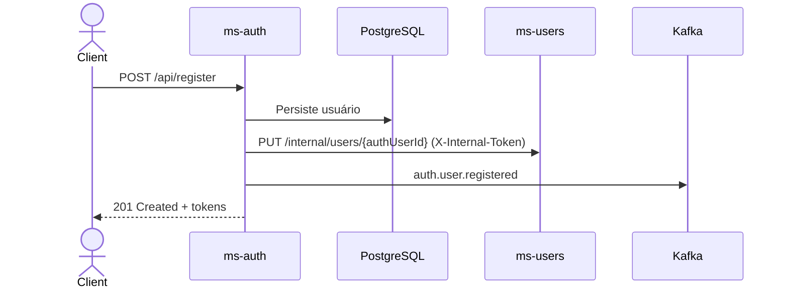

# ms-auth — EcoFy

> Microsserviço central de autenticação e autorização do EcoFy: emite e valida JWTs (RS256), publica o JWKS e é a fonte de verdade da identidade.

> 🇬🇧 **English summary first.**
> 🇧🇷 **Documentação técnica completa em Português abaixo.**

---

## 🇬🇧 English Summary

### Responsibility

The `ms-auth` service is the central **authentication & authorization** service of EcoFy.

It is responsible for:

* User registration and e-mail confirmation.
* Login and issuance of access/refresh tokens.
* Token refresh and revocation.
* Real JWT validation.
* Publishing the JWKS document for all Resource Servers.
* Password reset (anti-enumeration).
* Client-application management (admin).
* Synchronizing new users to `ms-users`.

It is the identity source of truth. Every other service validates tokens on its own, as an OAuth2 Resource Server, using the JWKS published here.

### Technology stack

* Java 25
* Spring Boot 4
* Spring Security
* OAuth2 Resource Server
* PostgreSQL
* Flyway
* Apache Kafka
* Maven
* JUnit 5
* Mockito

### Architecture

The service follows Hexagonal Architecture:

```text
core/domain
core/application
core/port/in
core/port/out
adapters/in
adapters/out
config
```

### Service configuration

| Property     | Value        |
| ------------ | ------------ |
| Port         | `8081`       |
| Context path | `/auth`      |
| Database     | PostgreSQL   |
| Messaging    | Apache Kafka |
| Token format | JWT (RS256)  |

Local base URL:

```text
http://localhost:8081/auth
```

### Main endpoints

The paths below are relative to the `/auth` context path.

| Method | Endpoint                        | Protection     | Description                        |
| ------ | ------------------------------- | -------------- | ---------------------------------- |
| `POST` | `/api/auth/token`               | Public         | Login → access + refresh token     |
| `POST` | `/api/auth/refresh`             | Public         | Refreshes tokens                   |
| `POST` | `/api/auth/validate`            | Public         | Validates signature + claims       |
| `POST` | `/api/auth/revoke`              | Public         | Revokes a refresh token            |
| `POST` | `/api/register`                 | Public         | Registers a user                   |
| `POST` | `/api/register/confirm-email`   | Public         | Confirms e-mail                    |
| `POST` | `/api/password/reset-request`   | Public         | Requests a password reset          |
| `POST` | `/api/password/reset-confirm`   | Public         | Confirms a password reset          |
| `GET`  | `/.well-known/jwks.json`        | Public         | JWKS document                      |
| `GET`  | `/api/user/me`                  | JWT            | Current user profile               |
| `POST` | `/api/admin/users`              | JWT + role     | Creates an admin user              |
| `POST` | `/api/admin/clients`            | JWT + role     | Registers a client application     |
| `GET`  | `/actuator/health`              | Public         | Reports service health             |
| `GET`  | `/actuator/info`                | Public         | Reports service information        |

### Security

* Access tokens are RS256 JWTs signed with rotating keys.
* The JWKS document is public.
* Admin endpoints require authentication and `ROLE_ADMIN`.
* `/api/auth/validate` performs a real signature, expiration and issuer check.

### Integration

After registration, the profile is synced to `ms-users` via internal HTTP `PUT /internal/users/{authUserId}` (header `X-Internal-Token`). The service also publishes `auth.user.registered` to Kafka.

### Known limitations

* Signing keys are local — there is no external Secret Manager / KMS integration yet.
* External PEM loading is guarded in `prod` but not yet fully implemented.
* Refresh tokens are stored as full JWTs (not hashed at rest).
* Reset/confirmation tokens are not yet persisted in a durable store with TTL.
* Direct user permissions are not persisted (only roles).
* There is no rate limiting on the authentication endpoints.
* The `auth.user.registered` Kafka event is not aligned with the `ms-users` consumer (`auth.user.created`); the HTTP sync is the working path.

---

# 🇧🇷 Documentação técnica

## 1. Visão geral

O `ms-auth` é o serviço central de **autenticação e autorização** do ecossistema EcoFy.

Ele emite e valida JWTs (RS256), publica o JWKS consumido pelos Resource Servers e gerencia registro, confirmação de e-mail, reset de senha, refresh/revogação de tokens e client applications.

A validação de token dos **demais** microsserviços é feita por eles próprios, como Resource Servers, usando o JWKS publicado aqui. O `ms-auth` é a fonte de verdade da identidade.

---

## 2. Stack tecnológica

| Tecnologia             | Responsabilidade                      |
| ---------------------- | ------------------------------------- |
| Java 25                | Linguagem principal                   |
| Spring Boot 4          | Framework da aplicação                |
| Spring Security        | Autenticação e autorização            |
| OAuth2 Resource Server | Validação de tokens JWT               |
| PostgreSQL             | Persistência relacional               |
| Flyway                 | Versionamento do schema               |
| Apache Kafka           | Publicação de eventos de identidade   |
| Maven Wrapper          | Build e gerenciamento de dependências |
| JUnit 5                | Testes automatizados                  |
| Mockito                | Testes unitários isolados             |

---

## 3. Arquitetura

O serviço segue Arquitetura Hexagonal, mantendo o domínio de identidade independente das tecnologias de transporte, persistência e mensageria.

Estrutura conceitual:

```text
src/main/java/br/com/ecofy/auth
├── core
│   ├── domain
│   ├── application
│   └── port
├── adapters
│   ├── in
│   └── out
└── config
```

### Responsabilidade das camadas

| Camada             | Responsabilidade                                       |
| ------------------ | ------------------------------------------------------ |
| `core/domain`      | Usuários, roles, tokens e regras de identidade         |
| `core/application` | Serviços de registro, login, refresh e reset           |
| `core/port/in`     | Casos de uso expostos pela aplicação                   |
| `core/port/out`    | Persistência, emissão de token, JWKS e sincronização   |
| `adapters/in`      | Controllers REST                                       |
| `adapters/out`     | JPA, provider de token, cliente HTTP e publicação Kafka|
| `config`           | Segurança, CORS, chaves JWT e infraestrutura           |

---

## 4. Configuração do serviço

| Configuração | Valor padrão |
| ------------ | ------------ |
| Porta        | `8081`       |
| Context path | `/auth`      |
| Banco        | PostgreSQL   |
| Mensageria   | Apache Kafka |
| Token        | JWT (RS256)  |

URL base local:

```text
http://localhost:8081/auth
```

Exemplo de endpoint completo:

```text
http://localhost:8081/auth/api/auth/token
```

---

## 5. Responsabilidades funcionais

O serviço é responsável por:

* Registrar usuários e confirmar e-mail.
* Efetuar login (password grant) e emitir access/refresh tokens.
* Renovar e revogar tokens.
* Validar JWT de forma real (assinatura, expiração e issuer).
* Expor o JWKS para os Resource Servers.
* Solicitar e efetivar reset de senha (anti-enumeração).
* Cadastrar client applications (admin).
* Sincronizar o usuário com o `ms-users` (HTTP interno + evento Kafka).

---

## 6. Endpoints

Os paths abaixo são relativos ao context path `/auth`. Os controllers aceitam tanto `/api/...` quanto `/api/v1/auth/...`.

### 6.1 Autenticação

```http
POST /api/auth/token
POST /api/auth/refresh
POST /api/auth/validate
POST /api/auth/revoke
```

### 6.2 Registro e senha

```http
POST /api/register
POST /api/register/confirm-email
POST /api/password/reset-request
POST /api/password/reset-confirm
```

### 6.3 JWKS e perfil

```http
GET  /.well-known/jwks.json
GET  /api/user/me
```

### 6.4 Administração

```http
POST /api/admin/users
POST /api/admin/clients
```

### 6.5 Actuator

| Método | Endpoint completo        | Descrição                |
| ------ | ------------------------ | ------------------------ |
| `GET`  | `/auth/actuator/health`  | Estado de saúde          |
| `GET`  | `/auth/actuator/info`    | Informações da aplicação |

---

## 7. Modelo de roles/authorities

Convenção única: **`ROLE_ADMIN`** e **`ROLE_USER`** (prefixo `ROLE_`, padrão do Spring Security). Aplicada de forma consistente em:

* **Seed** (`V2__seed_ms_auth_data.sql`): `ROLE_ADMIN`, `ROLE_USER`.
* **Código**: default de registro = `ROLE_USER`; default admin = `ROLE_ADMIN`, `ROLE_USER`.
* **JWT**: claim `roles` (ex.: `["ROLE_ADMIN","ROLE_USER"]`).
* **Spring Security**: `/api/admin/**` exige `hasRole("ADMIN")` (authority `ROLE_ADMIN`).

O `JwtAuthenticationConverter` mapeia o claim `roles` (já com prefixo `ROLE_`) para authorities, sem duplicar prefixo.

> A convenção anterior `AUTH_ADMIN`/`AUTH_USER` foi eliminada para remover ambiguidade e risco de falha de autorização.

---

## 8. Claims emitidas no JWT (access token)

| Claim                                 | Exemplo                | Observação                      |
| ------------------------------------- | ---------------------- | ------------------------------- |
| `sub`                                 | UUID do usuário        | subject                         |
| `email`                               | `user@ecofy.com`       |                                 |
| `name`                                | Nome completo          |                                 |
| `client_id`                           | `eco_dashboard_local`  |                                 |
| `scope`                               | `read write`           | somente se informado            |
| `roles`                               | `["ROLE_ADMIN"]`       | usado para autorização          |
| `permissions`                         | `["auth:user:admin"]`  | união de roles + permissões diretas |
| `typ`                                 | `ACCESS` \| `REFRESH`  | tipo interno do token           |
| `iss` / `aud` / `iat` / `exp` / `nbf` |                        | padrão                          |

Nenhum dado sensível (senha, segredo, PII além de e-mail/nome) é incluído no token.

---

## 9. JWKS e validação

* `GET /.well-known/jwks.json` publica a **chave pública real de assinatura** (`kty`, `kid`, `alg`, `use`, `n`, `e`), derivada diretamente do provider de tokens. Assim, os Resource Servers conseguem validar a assinatura dos JWTs.
* `POST /api/auth/validate` faz **validação real**: verifica a assinatura RSA, a expiração e o issuer (quando configurado) via `NimbusJwtDecoder`. Um token apenas "parseável", mas com assinatura inválida, é **rejeitado**.

---

## 10. Chaves JWT por profile

| Profile                    | Comportamento das chaves                                                                 |
| -------------------------- | ---------------------------------------------------------------------------------------- |
| `default` / `dev` / `test` | Geração de par RSA **em memória** (aceitável; documentado). Tokens não sobrevivem a restart. |
| `prod`                     | `JwtProdKeyGuard` **falha o startup** se as chaves não estiverem configuradas por fonte externa. |

> **Limitação conhecida (próximo passo):** o carregamento efetivo do PEM externo e a integração com secret manager ainda não estão implementados. Em produção, o guard garante que o serviço não suba silenciosamente com chave em memória.

---

## 11. Segurança

O serviço atua como emissor e como OAuth2 Resource Server para os próprios endpoints administrativos.

### 11.1 Segurança por profile

| Profile           | Endpoints públicos | Endpoints admin      | Chaves               |
| ----------------- | ------------------ | -------------------- | -------------------- |
| `default` / `dev` | login/registro/JWKS| exigem `ROLE_ADMIN`  | RSA em memória       |
| `test`            | idem               | exigem `ROLE_ADMIN`  | RSA em memória       |
| `prod`            | idem               | exigem `ROLE_ADMIN`  | PEM externo obrigatório |

### 11.2 CORS

Definido em `application.yaml` (`cors.allowed-*`) e **aplicado ao Spring Security** via `CorsConfigurationSource` + `http.cors(...)`:

* `allowed-origins`: `http://localhost:3000` (dev). Em produção, configure origins explícitos por ambiente.
* `allowCredentials=true` com origins **explícitos** (nunca `*` com credentials).

---

## 12. Integração com ms-users

Após registrar o usuário, o `RegisterUserService` chama `SyncUserToUsersMsPort.upsertUser(...)`:

* A chamada é **best-effort** — indisponibilidade do `ms-users` não impede o registro.
* O `authUserId` do path é tratado como fonte de verdade.
* O serviço também publica eventos de autenticação/registro no Kafka.



> ⚠️ O consumer do `ms-users` ainda espera `auth.user.created`. Enquanto o contrato Kafka não é alinhado, a sincronização HTTP interna é o fluxo suportado.

---

## 13. Contrato de erro

Todas as exceções passam por um `@RestControllerAdvice` global (`GlobalExceptionHandler`) e retornam `ApiErrorResponse`:

```json
{
  "timestamp": "2026-07-13T12:00:00Z",
  "status": 401,
  "error": "INVALID_CREDENTIALS",
  "message": "Invalid credentials",
  "path": "/auth/api/auth/token"
}
```

Erros de validação incluem `fieldErrors`. Erros inesperados retornam `500` genérico, **sem** stack trace ou detalhe interno.

---

## 14. Exemplos

```bash
# Login
curl -i http://localhost:8081/auth/api/auth/token -X POST \
  -H "Content-Type: application/json" \
  -d '{"clientId":"eco_dashboard_local","username":"user@ecofy.com","password":"secret"}'

# Validate (validação real de assinatura)
curl -i http://localhost:8081/auth/api/auth/validate -X POST \
  -H "Content-Type: application/json" -d '{"token":"<access_token>"}'

# Refresh
curl -i http://localhost:8081/auth/api/auth/refresh -X POST \
  -H "Content-Type: application/json" \
  -d '{"clientId":"eco_dashboard_local","refreshToken":"<refresh_token>"}'

# JWKS
curl -i http://localhost:8081/auth/.well-known/jwks.json

# Endpoint admin (exige ROLE_ADMIN no JWT)
curl -i http://localhost:8081/auth/api/admin/users -X POST \
  -H "Authorization: Bearer <admin_access_token>" \
  -H "Content-Type: application/json" \
  -d '{"email":"a@ecofy.com","password":"StrongPass123!","firstName":"A","lastName":"B"}'
```

---

## 15. Persistência

O serviço utiliza PostgreSQL com Flyway.

Principais dados persistidos:

* Usuários e roles.
* Refresh tokens.
* Client applications.

Migrations aplicadas:

```text
V1__init_ms_auth_schema.sql
V2__seed_ms_auth_data.sql
```

Configuração local padrão:

```text
jdbc:postgresql://localhost:5432/ecofy_auth
```

As alterações de schema devem ser realizadas por novas migrations. Migrations já aplicadas em ambientes compartilhados não devem ser modificadas.

---

## 16. Variáveis de ambiente

| Variável                                        | Valor padrão em desenvolvimento               | Descrição                          |
| ----------------------------------------------- | --------------------------------------------- | ---------------------------------- |
| `DB_URL`                                        | `jdbc:postgresql://localhost:5432/ecofy_auth` | URL JDBC                           |
| `DB_USER` / `DB_PASS`                           | Configuração local                            | Credenciais do PostgreSQL          |
| `KAFKA_BOOTSTRAP_SERVERS`                       | `localhost:19092`                             | Endereço do Kafka                  |
| `JWT_ISSUER`                                    | `http://localhost:8081/auth`                  | Claim `iss`                        |
| `JWT_AUDIENCE`                                  | `ecofy-api`                                   | Claim `aud`                        |
| `JWT_KEY_ID`                                    | `ecofy-auth-key-1`                            | `kid`                              |
| `JWT_PRIVATE_KEY_LOCATION` / `JWT_PUBLIC_KEY_LOCATION` | classpath (dev)                        | **obrigatórias externas em prod**  |
| `JWT_ACCESS_TTL` / `JWT_REFRESH_TTL`            | `900` / `2592000`                             | TTLs (segundos)                    |
| `USERS_MS_BASE_URL`                             | `http://localhost:8087/users`                 | Base do `ms-users`                 |
| `INTERNAL_TOKEN`                                | `local-internal-token`                        | Token do endpoint interno          |
| `CORS_ALLOWED_ORIGINS`                          | `http://localhost:3000`                       | Origins liberadas                  |

Exemplo local:

```env
DB_URL=jdbc:postgresql://localhost:5432/ecofy_auth
DB_USER=postgres
DB_PASS=postgres

KAFKA_BOOTSTRAP_SERVERS=localhost:19092
JWT_ISSUER=http://localhost:8081/auth
JWT_AUDIENCE=ecofy-api

USERS_MS_BASE_URL=http://localhost:8087/users
INTERNAL_TOKEN=local-internal-token
```

> Credenciais, chaves privadas e segredos de produção não devem ser versionados.

---

## 17. Execução local

### 17.1 Pré-requisitos

* JDK 25.
* PostgreSQL local ou Docker.
* Kafka local para os eventos de identidade.
* Porta `8081` disponível.

### 17.2 Executar com Maven Wrapper

Linux ou macOS:

```bash
./mvnw spring-boot:run
```

Windows:

```powershell
.\mvnw.cmd spring-boot:run
```

### 17.3 Verificar a aplicação

```bash
curl -i \
  "http://localhost:8081/auth/actuator/health"
```

Resposta esperada:

```json
{
  "status": "UP"
}
```

---

## 18. Build e testes

### 18.1 Executar os testes

Linux ou macOS:

```bash
./mvnw clean test
```

Windows:

```powershell
.\mvnw.cmd clean test
```

### 18.2 Gerar o pacote

```bash
./mvnw clean package
```

O artefato será gerado em:

```text
target/
```

### 18.3 Executar o JAR

```bash
java -jar target/*.jar
```

---

## 19. Estratégia de testes

A suíte atual inclui:

* Testes unitários (sem PostgreSQL/Kafka reais).
* JUnit 5.
* Mockito.
* Testes de segurança e de emissão/validação de token.
* Teste de inicialização do contexto.

Ainda são recomendados testes de integração para:

* Persistência com PostgreSQL via Testcontainers.
* Migrations Flyway.
* Fluxo de sincronização com `ms-users`.
* Publicação de eventos de identidade.

---

## 20. Observabilidade

O serviço disponibiliza endpoints do Spring Boot Actuator.

Principais endpoints:

```text
/auth/actuator/health
/auth/actuator/info
/auth/actuator/prometheus
```

A observabilidade deve acompanhar:

* Registros e logins.
* Falhas de autenticação.
* Emissão e revogação de tokens.
* Validações de token.
* Sincronizações com `ms-users`.
* Correlation ID e MDC.

---

## 21. Limitações conhecidas

* As chaves de assinatura são locais (sem Secret Manager / KMS externo).
* O carregamento de PEM externo é protegido em `prod`, mas ainda não implementado.
* Os refresh tokens são armazenados como JWT completo (não há hash em repouso).
* Tokens de reset/confirmação não são persistidos em store durável com TTL.
* Permissões **diretas** do usuário não são persistidas (apenas roles).
* Não há rate limiting nos endpoints de autenticação.
* O evento `auth.user.registered` não está alinhado ao consumer do `ms-users` (`auth.user.created`).

---

## 22. Próximos passos

1. Carregar PEM externo e integrar com secret manager para chaves de produção.
2. Armazenar o refresh token com hash em repouso.
3. Persistir tokens de reset/confirmação com TTL em store durável.
4. Persistir permissões diretas do usuário (`PermissionRepository`).
5. Adicionar rate limiting e proteção contra brute force nos endpoints de auth.
6. Alinhar o contrato Kafka com o consumer do `ms-users`.
7. Adicionar correlation ID e MDC ponta a ponta.
8. Criar métricas específicas de autenticação.
9. Restringir o Actuator em produção.

---

## 23. Resumo de implementação

| Recurso                          | Situação      |
| -------------------------------- | ------------- |
| Registro e confirmação de e-mail | Implementado  |
| Login e emissão de tokens        | Implementado  |
| Refresh e revogação              | Implementados |
| Validação real de JWT            | Implementada  |
| Publicação de JWKS               | Implementada  |
| Reset de senha (anti-enumeração) | Implementado  |
| Client applications (admin)      | Implementadas |
| Modelo de roles `ROLE_*`         | Implementado  |
| Sincronização HTTP com `ms-users`| Funcional     |
| Guard de chaves em produção      | Implementado  |
| Carregamento de PEM externo      | Pendente      |
| Secret manager / KMS             | Pendente      |
| Hash do refresh token em repouso | Pendente      |
| Rate limiting                    | Pendente      |
| Alinhamento do evento Kafka      | Pendente      |
| Observabilidade completa         | Parcial       |

---

## 24. Licença

Este microsserviço faz parte do projeto **EcoFy**.

Consulte o repositório principal para informações sobre:

* Arquitetura completa.
* Execução integrada.
* Contratos compartilhados.
* Infraestrutura.
* Fluxos Kafka.
* Segurança.
* Licença do projeto.
