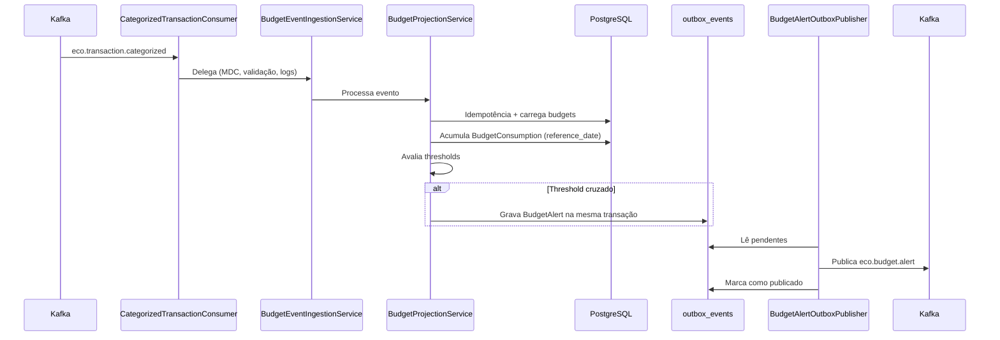

# ms-budgeting — EcoFy

> Microsserviço responsável pelos orçamentos (budgets), consolidação de consumo e alertas de orçamento no ecossistema EcoFy.

> 🇬🇧 **English summary first.**
> 🇧🇷 **Documentação técnica completa em Português abaixo.**

---

## 🇬🇧 English Summary

### Responsibility

The `ms-budgeting` service manages **budgets** per user, category and period.

It is responsible for:

* Budget CRUD with idempotency.
* Consolidating consumption from categorized transactions (Kafka).
* Persisting a `BudgetConsumption` projection with `referenceDate`.
* Evaluating thresholds and generating budget alerts (WARNING/CRITICAL).
* Publishing `eco.budget.alert` through a Transactional Outbox.
* Providing a consolidated overview per user.
* Running recalculation and cleanup schedulers.

### Technology stack

* Java 25
* Spring Boot 4
* Spring Security
* OAuth2 Resource Server
* PostgreSQL
* Flyway
* Apache Kafka
* Transactional Outbox
* Maven
* JUnit 5
* Mockito

### Architecture

The service follows Hexagonal Architecture:

```text
core/domain
core/application
core/port/in
core/port/out
adapters/in
adapters/out
config
```

### Service configuration

| Property       | Value              |
| -------------- | ------------------ |
| Port           | `8084`             |
| Context path   | `/budgeting`       |
| Database       | PostgreSQL         |
| Messaging      | Apache Kafka       |
| Consumer group | `ms-budgeting`     |

Local base URL:

```text
http://localhost:8084/budgeting
```

### Main endpoints

The paths below are relative to the `/budgeting` context path.

| Method   | Endpoint                             | Protection        | Description                          |
| -------- | ------------------------------------ | ----------------- | ------------------------------------ |
| `POST`   | `/api/budgeting/v1/budgets`          | JWT               | Creates a budget (idempotent)        |
| `PUT`    | `/api/budgeting/v1/budgets/{id}`     | JWT               | Updates a budget                     |
| `DELETE` | `/api/budgeting/v1/budgets/{id}`     | JWT               | Deletes a budget                     |
| `GET`    | `/api/budgeting/v1/budgets`          | JWT               | Lists budgets for the owner          |
| `GET`    | `/api/budgeting/v1/budgets/{id}`     | JWT               | Returns a budget by id               |
| `GET`    | `/api/budgeting/v1/budgets/overview` | JWT               | Consolidated overview (real consumption) |
| `GET`    | `/actuator/health`                   | Public            | Reports service health               |
| `GET`    | `/actuator/info`                     | Public            | Reports service information          |

The resource owner is derived from the JWT claim (`owner-claim`, default `sub`); a client-supplied `userId` is not trusted.

### Kafka integration

The service consumes:

```text
eco.transaction.categorized
```

The service publishes (through the Outbox):

```text
eco.budget.alert
```

Consumer failures use retry with backoff. Exhausted messages are forwarded to `<topic>.DLT`.

### Security

* Actuator and Swagger are public.
* Business endpoints require a valid JWT and derive ownership from the token.
* `permit-all` eases local testing; production requires JWT.
* JWT validation uses the JWKS endpoint exposed by `ms-auth`.

Main environment variable:

```text
BGT_SECURITY_PERMIT_ALL
```

### Known limitations

* Explicit schema versioning for `BUDGET_ALERT` is not yet formalized.
* `correlationId` is not propagated from the source transaction to the alert.
* Correlation ID/MDC is present in the Kafka consumer, not yet in the REST layer.
* The overview does not yet aggregate alerts per period.
* Alert enrichment fields are populated on publish but not persisted in the alert table.

---

# 🇧🇷 Documentação técnica

## 1. Visão geral

O `ms-budgeting` gerencia **orçamentos (budgets)** por usuário, categoria e período no ecossistema EcoFy.

O serviço consolida o consumo a partir das transações categorizadas recebidas do `ms-categorization`, mantém uma projeção de consumo por budget e gera alertas quando o consumo cruza os limites configurados.

A publicação dos alertas usa uma implementação de **Transactional Outbox**, enquanto falhas no consumo são tratadas por retry e Dead Letter Topic.

O `ms-budgeting` não categoriza transações nem envia notificações. Essas responsabilidades pertencem, respectivamente, ao `ms-categorization` e ao `ms-notification`.

---

## 2. Stack tecnológica

| Tecnologia             | Responsabilidade                      |
| ---------------------- | ------------------------------------- |
| Java 25                | Linguagem principal                   |
| Spring Boot 4          | Framework da aplicação                |
| Spring Security        | Autenticação e autorização            |
| OAuth2 Resource Server | Validação de tokens JWT               |
| PostgreSQL             | Persistência relacional               |
| Flyway                 | Versionamento do schema               |
| Apache Kafka           | Integração assíncrona                 |
| Transactional Outbox   | Publicação confiável de alertas       |
| Maven Wrapper          | Build e gerenciamento de dependências |
| JUnit 5                | Testes automatizados                  |
| Mockito                | Testes unitários isolados             |

---

## 3. Arquitetura

O serviço segue Arquitetura Hexagonal, mantendo o domínio de orçamentos independente das tecnologias de transporte, persistência e mensageria.

Estrutura conceitual:

```text
src/main/java/br/com/ecofy/ms_budgeting
├── core
│   ├── domain
│   ├── application
│   └── port
├── adapters
│   ├── in
│   └── out
└── config
```

### Responsabilidade das camadas

| Camada             | Responsabilidade                                        |
| ------------------ | ------------------------------------------------------- |
| `core/domain`      | Budgets, consumo, alertas e o value object `Money`      |
| `core/application` | Serviços de CRUD, projeção de consumo e alertas         |
| `core/port/in`     | Casos de uso expostos pela aplicação                    |
| `core/port/out`    | Persistência, idempotência, Outbox e publicação         |
| `adapters/in`      | Controllers REST e consumers Kafka                      |
| `adapters/out`     | JPA, Outbox, publicação Kafka e mapeadores              |
| `config`           | Segurança, Kafka, Outbox, schedulers e infraestrutura   |

---

## 4. Configuração do serviço

| Configuração   | Valor padrão   |
| -------------- | -------------- |
| Porta          | `8084`         |
| Context path   | `/budgeting`   |
| Banco          | PostgreSQL     |
| Mensageria     | Apache Kafka   |
| Consumer group | `ms-budgeting` |

URL base local:

```text
http://localhost:8084/budgeting
```

Exemplo de endpoint completo:

```text
http://localhost:8084/budgeting/api/budgeting/v1/budgets
```

---

## 5. Responsabilidades funcionais

O serviço é responsável por:

* Criar, atualizar, remover e consultar budgets, com idempotência.
* Consumir transações categorizadas e acumular consumo por budget/período.
* Persistir a projeção `BudgetConsumption`.
* Avaliar thresholds e gerar alertas (WARNING/CRITICAL).
* Publicar alertas em `eco.budget.alert` via Outbox.
* Fornecer um overview consolidado por usuário.
* Executar rotinas agendadas de recálculo e limpeza.

---

## 6. Endpoints

Os paths abaixo são relativos ao context path `/budgeting`.

| Método   | Path                                 | Auth | Descrição                                    |
| -------- | ------------------------------------ | ---- | -------------------------------------------- |
| `POST`   | `/api/budgeting/v1/budgets`          | JWT  | Cria budget (idempotente via `Idempotency-Key`) |
| `PUT`    | `/api/budgeting/v1/budgets/{id}`     | JWT  | Atualiza budget                              |
| `DELETE` | `/api/budgeting/v1/budgets/{id}`     | JWT  | Remove budget                                |
| `GET`    | `/api/budgeting/v1/budgets`          | JWT  | Lista budgets do dono                        |
| `GET`    | `/api/budgeting/v1/budgets/{id}`     | JWT  | Busca por id                                 |
| `GET`    | `/api/budgeting/v1/budgets/overview` | JWT  | Overview (consumo real por budget)           |

### 6.1 Actuator

| Método | Endpoint completo             | Descrição                |
| ------ | ----------------------------- | ------------------------ |
| `GET`  | `/budgeting/actuator/health`  | Estado de saúde          |
| `GET`  | `/budgeting/actuator/info`    | Informações da aplicação |
| `GET`  | `/budgeting/actuator/prometheus` | Métricas Prometheus   |

O dono do recurso é derivado da claim do JWT (`owner-claim`, padrão `sub`). Um `userId` informado pelo cliente não é confiável.

---

## 7. Fluxo de consumo (Kafka)



### Etapas

1. `CategorizedTransactionConsumer` consome `eco.transaction.categorized` e **delega ao `BudgetEventIngestionService`**, que centraliza MDC (runId/correlationId/eventId), validação de campos obrigatórios, logs START/DONE/FAIL e o wrapping de exceções.
2. `BudgetProjectionService`: idempotência → carrega budgets do usuário → filtra por categoria/período → acumula `BudgetConsumption` (persistido, com `reference_date = period_end`) → avalia thresholds → cria o alerta.
3. O alerta é gravado na Outbox, na mesma transação da projeção, e publicado posteriormente pelo `BudgetAlertOutboxPublisher`.

Consumer group: `ms-budgeting` (`KAFKA_CONSUMER_GROUP_ID`).

---

## 8. Idempotência

`IdempotencyPort.tryAcquire(key, ttl, scope)` grava a chave textual (coluna `idem_key`). As chaves são textuais (ex.: `kafka:categorized-tx:tx:...`, `alert:...`). O TTL é configurável por `ecofy.budgeting.idempotency.ttl` (padrão `PT24H`).

---

## 9. Alertas e evento para ms-notification

O alerta é gerado quando o consumo cruza o threshold (`WARNING` ≥ 80%, `CRITICAL` ≥ 95%, configurável). É publicado em `eco.budget.alert` como `BudgetAlertEvent`:

```json
{
  "userId": "uuid",
  "budgetId": "uuid",
  "categoryId": "uuid",
  "limitAmount": 1000.00,
  "consumedAmount": 800.00,
  "consumedPct": 80,
  "severity": "WARNING",
  "metadata": {
    "eventId": "…",
    "correlationId": null,
    "occurredAt": "2026-01-15T12:00:00Z",
    "source": "ms-budgeting"
  }
}
```

> O payload **espelha exatamente** o contrato `BudgetAlertEventMessage` do `ms-notification`, que exige `userId` (não-nulo) e lê `categoryId/limitAmount/consumedAmount/consumedPct`. `metadata.eventId` alimenta a idempotência do `ms-notification`. A chave de partição do evento é `userId` (`partition-key-field`).

---

## 10. Confiabilidade e Transactional Outbox

A publicação de alertas usa o padrão **Transactional Outbox**: o alerta é gravado em `outbox_events` na mesma transação da projeção de consumo, e o `BudgetAlertOutboxPublisher` o entrega ao broker posteriormente, com retry e confirmação.

### Configuração da Outbox

Prefixo `ecofy.budgeting.outbox`.

| Propriedade           | Valor padrão | Finalidade                                    |
| --------------------- | -----------: | --------------------------------------------- |
| `batch-size`          |        `100` | Tamanho do lote lido por ciclo                |
| `poll-interval`       |         `1s` | Intervalo de leitura de pendentes             |
| `max-attempts`        |         `10` | Tentativas antes do descarte auditável        |
| `initial-backoff`     |         `1s` | Backoff inicial                               |
| `backoff-multiplier`  |          `2` | Fator de crescimento do backoff               |
| `max-backoff`         |         `5m` | Teto do backoff                               |
| `processing-timeout`  |         `5m` | Libera registros abandonados em processamento |
| `published-retention` |         `7d` | Retenção de eventos já publicados             |

### Retry e DLT do consumer

O `KafkaErrorHandlingConfig` configura um `DefaultErrorHandler` com backoff e um `DeadLetterPublishingRecoverer` que encaminha mensagens irrecuperáveis para `<topic>.DLT` após esgotar as tentativas.

O `OutboxHealthIndicator` reporta a saúde da Outbox e o `OutboxMetricsBinder` expõe métricas — ambos fora do liveness, pois reiniciar o pod não conserta o broker.

---

## 11. Status do budget e cleanup/archiving

Status: `ACTIVE`, `PAUSED`, `ARCHIVED`. O `cleanup` (scheduler) remove budgets `ARCHIVED` com `archived_at <= cutoff`. O mapper preenche `archived_at` ao persistir um budget ARCHIVED.

---

## 12. Schedulers

Prefixo `ecofy.budgeting.scheduling.*`. O `SchedulingConfig` (`@EnableScheduling`) é ligável por `scheduling.enabled` (desligado no profile `test`).

| Propriedade              | Default                  | Descrição                 |
| ------------------------ | ------------------------ | ------------------------- |
| `enabled`                | `true` (`false` em test) | Liga `@EnableScheduling`  |
| `recalculation-enabled`  | `true`                   | Habilita recálculo        |
| `recalculate-cron`       | `0 0/15 * * * *`         | Cron do recálculo         |
| `cleanup-enabled`        | `false`                  | Habilita limpeza          |
| `cleanup-cron`           | `0 0 3 * * *`            | Cron da limpeza           |
| `cleanup-retention-days` | `90`                     | Retenção                  |

---

## 13. Segurança

O serviço atua como OAuth2 Resource Server. A validação JWT utiliza o endpoint JWKS do `ms-auth`.

Configuração:

```text
JWT_JWKS_URI=http://localhost:8081/auth/.well-known/jwks.json
```

### 13.1 Segurança por profile

| Profile           | `permit-all` | Banco                | Kafka                   |
| ----------------- | -----------: | -------------------- | ----------------------- |
| `default` / `dev` |       `true` | PostgreSQL local     | Broker local            |
| `test`            |       `true` | create-drop          | Listeners desabilitados |
| `prod`            |      `false` | Configuração externa | SASL/SSL                |

Actuator e Swagger permanecem públicos. As rotas de budgets derivam o dono do recurso da claim `sub` (`owner-claim`), garantindo que um usuário não acesse os budgets de outro.

### 13.2 Propriedade de segurança

```text
ecofy.budgeting.security.permit-all
```

Variável de ambiente:

```text
BGT_SECURITY_PERMIT_ALL
```

Em produção:

```env
BGT_SECURITY_PERMIT_ALL=false
```

---

## 14. Contrato de erro

`RestExceptionHandler` global retorna `ApiErrorResponse` padronizado:

* `404` — `BudgetNotFound`.
* `409` — `BudgetAlreadyExists` / `IdempotencyViolation`.
* `400` — `BusinessValidation`, Bean Validation, `InvalidField`, `InvalidCurrency`, `MissingIdempotencyKey`.
* `500` — demais exceções de aplicação (com `code`) e fallback genérico, **sem** stack trace.

---

## 15. Persistência

O serviço utiliza PostgreSQL com Flyway.

Principais tabelas:

| Tabela               | Finalidade                                |
| -------------------- | ----------------------------------------- |
| `budgets`            | Orçamentos por usuário/categoria/período  |
| `budget_consumption` | Projeção de consumo por budget            |
| `budget_alert`       | Alertas gerados                           |
| `idempotency_keys`   | Controle de idempotência                  |
| `outbox_events`      | Eventos pendentes da Transactional Outbox |

Configuração local padrão:

```text
jdbc:postgresql://localhost:5436/ecofy_budgeting
```

As alterações de schema devem ser realizadas por novas migrations. Migrations já aplicadas em ambientes compartilhados não devem ser modificadas.

---

## 16. Variáveis de ambiente

| Variável                                          | Valor padrão em desenvolvimento                    | Descrição                     |
| ------------------------------------------------- | -------------------------------------------------- | ----------------------------- |
| `DB_URL`                                          | `jdbc:postgresql://localhost:5436/ecofy_budgeting` | URL JDBC                      |
| `DB_USER` / `DB_PASS`                             | Configuração local                                 | Credenciais do PostgreSQL     |
| `KAFKA_BOOTSTRAP_SERVERS`                         | `localhost:19092`                                  | Endereço do Kafka             |
| `KAFKA_CONSUMER_GROUP_ID`                         | `ms-budgeting`                                     | Consumer group                |
| `JWT_JWKS_URI`                                    | `http://localhost:8081/auth/.well-known/jwks.json` | JWKS do `ms-auth`             |
| `BGT_SECURITY_PERMIT_ALL`                         | `true` (dev) / `false` (prod)                      | Libera `/api/budgeting/**`    |
| `BGT_OWNER_CLAIM`                                 | `sub`                                              | Claim usada como dono         |
| `BGT_TOPIC_TX_CATEGORIZED`                        | `eco.transaction.categorized`                      | Tópico consumido              |
| `BGT_TOPIC_BUDGET_ALERT`                          | `eco.budget.alert`                                 | Tópico publicado              |
| `BGT_ALERT_WARNING_PCT` / `BGT_ALERT_CRITICAL_PCT`| `80` / `95`                                        | Thresholds                    |
| `BGT_IDEMPOTENCY_TTL`                             | `PT24H`                                            | TTL da idempotência           |
| `BGT_DEFAULT_CURRENCY`                            | `BRL`                                              | Moeda padrão do `Money`       |

Exemplo local:

```env
DB_URL=jdbc:postgresql://localhost:5436/ecofy_budgeting
DB_USER=postgres
DB_PASS=postgres

KAFKA_BOOTSTRAP_SERVERS=localhost:19092
JWT_JWKS_URI=http://localhost:8081/auth/.well-known/jwks.json

BGT_SECURITY_PERMIT_ALL=true
```

> Credenciais e segredos de produção não devem ser versionados.

---

## 17. Execução local

### 17.1 Pré-requisitos

* JDK 25.
* PostgreSQL local ou Docker.
* Kafka local para o fluxo de consumo.
* Porta `8084` disponível.
* `ms-auth` acessível quando JWT for exigido.

### 17.2 Executar com Maven Wrapper

Linux ou macOS:

```bash
./mvnw spring-boot:run
```

Windows:

```powershell
.\mvnw.cmd spring-boot:run
```

### 17.3 Verificar a aplicação

```bash
curl -i \
  "http://localhost:8084/budgeting/actuator/health"
```

Resposta esperada:

```json
{
  "status": "UP"
}
```

---

## 18. Build e testes

### 18.1 Executar os testes

Linux ou macOS:

```bash
./mvnw clean test
```

Windows:

```powershell
.\mvnw.cmd clean test
```

### 18.2 Executar com o profile de teste

```bash
./mvnw clean test -Dspring.profiles.active=test
```

### 18.3 Gerar o pacote

```bash
./mvnw clean package
```

O artefato será gerado em:

```text
target/
```

### 18.4 Executar o JAR

```bash
java -jar target/*.jar
```

---

## 19. Estratégia de testes

A suíte atual inclui:

* Testes unitários.
* JUnit 5.
* Mockito.
* Testes de segurança e de contrato do evento de alerta.
* Testes de mapeamento e de tipo de id de `BudgetConsumption`.
* Teste de inicialização do contexto.

Ainda são recomendados testes de integração para:

* Consumo real de `eco.transaction.categorized`.
* Publicação de `eco.budget.alert` via Outbox.
* Recuperação da Outbox após indisponibilidade do broker.
* Roteamento para DLT com broker real.
* Persistência com PostgreSQL via Testcontainers.

---

## 20. Observabilidade

O serviço disponibiliza endpoints do Spring Boot Actuator.

Principais endpoints:

```text
/budgeting/actuator/health
/budgeting/actuator/info
/budgeting/actuator/prometheus
```

A observabilidade deve acompanhar:

* Budgets criados, atualizados e removidos.
* Consumo consolidado por budget.
* Alertas gerados por severidade.
* Eventos pendentes na Outbox.
* Eventos encaminhados para DLT.
* Lag do consumer.
* Correlation ID e MDC.

---

## 21. Limitações conhecidas

* Não há versionamento explícito de schema do evento `BUDGET_ALERT` (ex.: header `schemaVersion`).
* O `correlationId` do alerta é `null` (não propagado da transação de origem até o alerta).
* Correlation ID/MDC ainda não está presente na camada REST (hoje no consumer Kafka).
* O `overview` consolida consumo real por budget, mas ainda não agrega alertas por período.
* Os campos de enriquecimento do `BudgetAlert` são preenchidos no fluxo de publicação, mas não são persistidos na tabela de alertas.

---

## 22. Próximos passos

1. Formalizar o versionamento de schema do evento `BUDGET_ALERT`.
2. Propagar o `correlationId` da transação de origem até o alerta.
3. Adicionar correlation ID/MDC também na camada REST.
4. Agregar alertas por período no `overview`.
5. Persistir os campos de enriquecimento do alerta.
6. Criar métricas de negócio específicas por budget/alerta.
7. Implementar testes de integração com broker e banco reais.
8. Documentar o replay administrativo da DLT.

---

## 23. Resumo de implementação

| Recurso                          | Situação      |
| -------------------------------- | ------------- |
| CRUD de budgets                  | Implementado  |
| Idempotência                     | Implementada  |
| Projeção de consumo              | Implementada  |
| Thresholds e alertas             | Implementados |
| Transactional Outbox de alertas  | Implementada  |
| Retry + Dead Letter Topic        | Implementados |
| Value object `Money`             | Implementado  |
| Ownership por claim `sub`        | Implementado  |
| Overview consolidado             | Implementado  |
| Schedulers de recálculo/cleanup  | Implementados |
| Segurança JWT                    | Implementada  |
| Versionamento de schema do evento| Pendente      |
| Propagação de `correlationId`    | Pendente      |
| Persistência do enriquecimento   | Pendente      |
| Testes de integração             | Pendentes     |
| Observabilidade completa         | Parcial       |

---

## 24. Licença

Este microsserviço faz parte do projeto **EcoFy**.

Consulte o repositório principal para informações sobre:

* Arquitetura completa.
* Execução integrada.
* Contratos compartilhados.
* Infraestrutura.
* Fluxos Kafka.
* Segurança.
* Licença do projeto.
