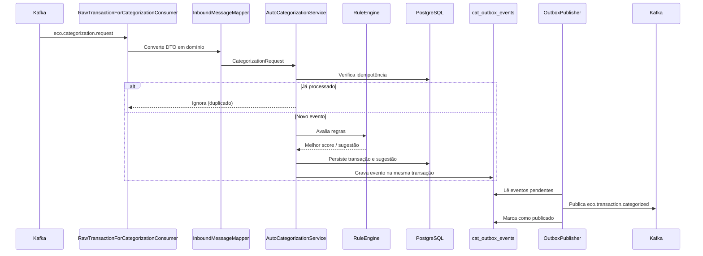

# ms-categorization — EcoFy

> Microsserviço responsável pela categorização automática e manual de transações financeiras no ecossistema EcoFy.

> 🇬🇧 **English summary first.**
> 🇧🇷 **Documentação técnica completa em Português abaixo.**

---

## 🇬🇧 English Summary

### Responsibility

The `ms-categorization` service categorizes financial transactions received from `ms-ingestion`.

It supports:

* Automatic categorization through Kafka.
* Manual categorization through REST.
* Category and categorization-rule management.
* Suggestion persistence and lookup.
* Idempotent event consumption.
* Reliable downstream publication through a Transactional Outbox.
* Retry and Dead Letter Topic handling for consumer failures.

The categorized transaction event is intended for downstream consumers such as:

* `ms-budgeting`
* `ms-insights`

### Technology stack

* Java 25
* Spring Boot 4
* Spring Security
* OAuth2 Resource Server
* PostgreSQL
* Flyway
* Apache Kafka
* Transactional Outbox
* Maven
* JUnit 5
* Mockito

### Architecture

The service follows Hexagonal Architecture:

```text
core/domain
core/application
core/port/in
core/port/out
adapters/in
adapters/out
config
```

### Service configuration

| Property       | Value                  |
| -------------- | ---------------------- |
| Port           | `8083`                 |
| Context path   | `/categorization`      |
| Database       | PostgreSQL             |
| Messaging      | Apache Kafka           |
| Consumer group | `ms-categorization-v2` |

Local base URL:

```text
http://localhost:8083/categorization
```

### Main endpoints

The paths below are relative to the `/categorization` context path.

| Method | Endpoint                                       | Protection          | Description                              |
| ------ | ---------------------------------------------- | ------------------- | ---------------------------------------- |
| `POST` | `/api/categorization/v1/categories`            | JWT in production   | Creates a category                       |
| `GET`  | `/api/categorization/v1/categories`            | JWT in production   | Lists active categories                  |
| `POST` | `/api/categorization/v1/rules`                 | JWT in production   | Creates a categorization rule            |
| `GET`  | `/api/categorization/v1/rules`                 | JWT in production   | Lists categorization rules               |
| `POST` | `/api/categorization/v1/manual`                | JWT in production   | Applies a category manually              |
| `GET`  | `/api/categorization/v1/suggestions/{txId}`    | JWT in production   | Returns the suggestion for a transaction |
| `GET`  | `/actuator/health`                             | Public/configurable | Reports service health                   |
| `GET`  | `/actuator/info`                               | Public/configurable | Reports service information              |

### Kafka integration

The service consumes:

```text
eco.categorization.request
```

The service publishes:

```text
eco.transaction.categorized
eco.categorization.applied
```

Consumer failures use retry with exponential backoff. Exhausted or non-recoverable messages are forwarded to:

```text
eco.categorization.request.dlt
```

### Reliability model

The service uses:

* At-least-once delivery.
* Idempotent consumption.
* Transactional Outbox.
* Exponential retry.
* Dead Letter Topic.
* Outbox recovery after broker outages.
* Auditable discarded events.

The system does not claim exactly-once delivery.

### Security

The API is protected according to the active profile.

* Development and test environments may enable `permit-all`.
* Production requires a valid JWT.
* JWT validation uses the JWKS endpoint exposed by `ms-auth`.

Main environment variable:

```text
CAT_SECURITY_PERMIT_ALL
```

### Known limitations

* Downstream idempotency is not yet implemented in `ms-budgeting` and `ms-insights`.
* The current downstream event does not contain `userId`.
* Existing downstream consumers expect fields that differ from the event envelope.
* The Kafka partition key is `transactionId`, not `userId`.
* A crash after broker acknowledgement and before the Outbox status update may cause republication.
* `RuleCondition` still contains Jackson persistence annotations.

---

# 🇧🇷 Documentação técnica

## 1. Visão geral

O `ms-categorization` é responsável por transformar transações financeiras brutas em transações categorizadas.

O serviço recebe transações do `ms-ingestion`, avalia regras configuradas, registra sugestões e publica o resultado para os serviços que dependem da categorização.

Os dois fluxos principais são:

1. **Categorização automática**, iniciada por eventos Kafka.
2. **Categorização manual**, iniciada pela API REST.

A confiabilidade da publicação é garantida por uma implementação de **Transactional Outbox**, enquanto falhas no consumo são tratadas por retry e Dead Letter Topic.

O `ms-categorization` não define orçamentos nem gera dashboards. Essas responsabilidades pertencem, respectivamente, ao `ms-budgeting` e ao `ms-insights`.

---

## 2. Stack tecnológica

| Tecnologia             | Responsabilidade                |
| ---------------------- | ------------------------------- |
| Java 25                | Linguagem principal             |
| Spring Boot 4          | Framework da aplicação          |
| Spring Security        | Autenticação e autorização      |
| OAuth2 Resource Server | Validação de JWT                |
| PostgreSQL             | Persistência relacional         |
| Flyway                 | Versionamento do schema         |
| Apache Kafka           | Integração assíncrona           |
| Transactional Outbox   | Publicação confiável de eventos |
| Maven Wrapper          | Build e dependências            |
| JUnit 5                | Testes automatizados            |
| Mockito                | Testes unitários isolados       |

---

## 3. Arquitetura

O serviço segue Arquitetura Hexagonal, mantendo o domínio independente dos contratos de transporte, persistência e mensageria.

Estrutura conceitual:

```text
src/main/java/br/com/ecofy/ms_categorization
├── core
│   ├── domain
│   ├── application
│   └── port
├── adapters
│   ├── in
│   └── out
└── config
```

### Responsabilidade das camadas

| Camada             | Responsabilidade                                             |
| ------------------ | ------------------------------------------------------------ |
| `core/domain`      | Entidades, value objects, enums, regras e eventos de domínio |
| `core/application` | Serviços de categorização automática e manual                |
| `core/port/in`     | Casos de uso expostos pela aplicação                         |
| `core/port/out`    | Persistência, idempotência, Outbox e publicação              |
| `adapters/in`      | Controllers REST e consumers Kafka                           |
| `adapters/out`     | JPA, Outbox, publicação Kafka e mapeadores                   |
| `config`           | Segurança, Kafka, properties, retry e infraestrutura         |

O core não depende dos DTOs Kafka.

O adapter de entrada converte o contrato recebido em um objeto de domínio antes de chamar o serviço de aplicação.

---

## 4. Configuração do serviço

| Configuração   | Valor padrão           |
| -------------- | ---------------------- |
| Porta          | `8083`                 |
| Context path   | `/categorization`      |
| Banco          | PostgreSQL             |
| Mensageria     | Apache Kafka           |
| Consumer group | `ms-categorization-v2` |

URL base local:

```text
http://localhost:8083/categorization
```

Exemplo de endpoint completo:

```text
http://localhost:8083/categorization/api/categorization/v1/categories
```

---

## 5. Responsabilidades funcionais

O serviço é responsável por:

* Criar e listar categorias.
* Criar e listar regras de categorização.
* Receber solicitações de categorização por Kafka.
* Aplicar regras automaticamente.
* Permitir categorização manual.
* Persistir transações e sugestões.
* Consultar sugestões por transação.
* Evitar o reprocessamento de mensagens duplicadas.
* Publicar eventos de transações categorizadas.
* Publicar eventos de auditoria.
* Garantir a consistência entre persistência e publicação.
* Encaminhar mensagens irrecuperáveis para DLT.

---

## 6. Fluxo de categorização automática

O fluxo automático começa no tópico:

```text
eco.categorization.request
```



### Etapas

1. O consumer recebe a solicitação de categorização.
2. O contrato Kafka é convertido em objeto de domínio.
3. A idempotência é verificada antes do processamento.
4. O motor de regras avalia as regras aplicáveis.
5. A melhor regra por score é selecionada.
6. A transação e a sugestão são persistidas.
7. O evento de saída é gravado na Outbox, na mesma transação do domínio.
8. O `OutboxPublisher` publica o evento posteriormente, com retry e confirmação do broker.

---

## 7. Motor de regras

A avaliação de regras é configurável pelo prefixo `ecofy.categorization.rule-engine`.

| Propriedade                          | Valor padrão | Finalidade                                        |
| ------------------------------------ | -----------: | ------------------------------------------------- |
| `max-rules-to-evaluate`              |        `200` | Limite de regras avaliadas por transação          |
| `best-score-wins`                    |       `true` | Seleciona a regra de maior score                  |
| `min-score-to-categorize`            |         `40` | Score mínimo para categorizar automaticamente     |
| `create-suggestion-when-unmatched`   |       `true` | Cria sugestão mesmo quando nenhuma regra atinge o mínimo |

Quando nenhuma regra atinge o score mínimo, o serviço pode registrar apenas uma sugestão, sem categorizar automaticamente.

---

## 8. Fluxo de categorização manual

A categorização manual é iniciada pela API REST:

```http
POST /api/categorization/v1/manual
```

Endpoint completo:

```text
POST /categorization/api/categorization/v1/manual
```

O fluxo manual:

1. Recebe a categoria informada pelo usuário.
2. Aplica a categoria à transação indicada.
3. Persiste o resultado.
4. Grava o evento correspondente na Outbox.
5. Publica o evento de auditoria em `eco.categorization.applied`.

---

## 9. Endpoints

Os paths abaixo são relativos ao context path `/categorization`.

### 9.1 Categorias

```http
POST /api/categorization/v1/categories
GET  /api/categorization/v1/categories
```

### 9.2 Regras

```http
POST /api/categorization/v1/rules
GET  /api/categorization/v1/rules
```

### 9.3 Categorização manual

```http
POST /api/categorization/v1/manual
```

### 9.4 Sugestões

```http
GET /api/categorization/v1/suggestions/{transactionId}
```

### 9.5 Actuator

| Método | Endpoint completo                   | Descrição                |
| ------ | ----------------------------------- | ------------------------ |
| `GET`  | `/categorization/actuator/health`   | Estado de saúde          |
| `GET`  | `/categorization/actuator/info`     | Informações da aplicação |

---

## 10. Confiabilidade e Transactional Outbox

A publicação de eventos usa o padrão **Transactional Outbox**.

O evento de saída é gravado na tabela `cat_outbox_events` **na mesma transação** que persiste a transação categorizada. Um publisher separado lê os registros pendentes e os entrega ao broker com retry e confirmação.

### Configuração da Outbox

As propriedades usam o prefixo `ecofy.categorization.outbox`.

| Propriedade           | Valor padrão | Finalidade                                       |
| --------------------- | -----------: | ------------------------------------------------ |
| `batch-size`          |        `100` | Tamanho do lote lido por ciclo                   |
| `poll-interval`       |         `1s` | Intervalo de leitura de pendentes                |
| `max-attempts`        |         `10` | Tentativas antes do descarte auditável           |
| `initial-backoff`     |         `1s` | Backoff inicial                                  |
| `backoff-multiplier`  |          `2` | Fator de crescimento do backoff                  |
| `max-backoff`         |         `5m` | Teto do backoff                                  |
| `processing-timeout`  |         `5m` | Libera registros abandonados em processamento    |
| `published-retention` |         `7d` | Retenção de eventos já publicados                |

### Retry e DLT do consumer

As propriedades usam o prefixo `ecofy.categorization.kafka`.

| Propriedade                | Valor padrão           | Finalidade                            |
| -------------------------- | ---------------------- | ------------------------------------- |
| `consumer-group`           | `ms-categorization-v2` | Consumer group, espelhado nos headers |
| `concurrency`              | `3`                    | Threads de consumo                    |
| `dlt-suffix`               | `.dlt`                 | Sufixo do tópico DLT                  |
| `supported-event-versions` | `1`                    | Versões de evento aceitas             |
| `retry.max-attempts`       | `3`                    | Tentativas (inclui a entrega original)|
| `retry.initial-interval`   | `1s`                   | Intervalo inicial                     |
| `retry.multiplier`         | `2`                    | Fator do backoff                      |
| `retry.max-interval`       | `10s`                  | Teto do intervalo                     |

O `ErrorHandlingDeserializer` envolve os deserializers reais, garantindo que um payload malformado siga para a DLT em vez de virar poison pill reentregue indefinidamente.

---

## 11. Modelo de confiabilidade

O serviço adota:

* Entrega **at-least-once**.
* Consumo idempotente.
* Transactional Outbox.
* Retry exponencial.
* Dead Letter Topic.
* Recuperação da Outbox após indisponibilidade do broker.
* Descarte auditável de eventos irrecuperáveis.

O serviço **não** promete entrega exactly-once. Um crash entre o ack do broker e a atualização de status na Outbox pode causar republicação, tolerada pela idempotência dos consumidores downstream.

---

## 12. Tópicos Kafka

As propriedades de tópicos usam o prefixo `ecofy.categorization.topics`.

| Propriedade               | Valor padrão                 | Direção | Finalidade                        |
| ------------------------- | ---------------------------- | ------- | --------------------------------- |
| `categorization-request`  | `eco.categorization.request` | Consome | Solicitações de categorização     |
| `transaction-categorized` | `eco.transaction.categorized`| Publica | Transação categorizada (downstream)|
| `categorization-applied`  | `eco.categorization.applied` | Publica | Auditoria de categorização manual |

Estrutura de configuração:

```yaml
ecofy:
  categorization:
    topics:
      categorization-request: eco.categorization.request
      transaction-categorized: eco.transaction.categorized
      categorization-applied: eco.categorization.applied
```

---

## 13. Segurança

O serviço atua como OAuth2 Resource Server.

A validação JWT utiliza o endpoint JWKS do `ms-auth`.

Configuração:

```text
JWT_JWKS_URI=http://localhost:8081/auth/.well-known/jwks.json
```

### 13.1 Segurança por profile

| Profile           | `permit-all` | Banco                | Kafka                   |
| ----------------- | -----------: | -------------------- | ----------------------- |
| `default` / `dev` |       `true` | PostgreSQL local     | Broker local            |
| `test`            |       `true` | H2/create-drop       | Listeners desabilitados |
| `prod`            |      `false` | Configuração externa | SASL/SSL                |

### 13.2 Propriedade de segurança

```text
ecofy.categorization.security.permit-all
```

Variável de ambiente:

```text
CAT_SECURITY_PERMIT_ALL
```

Em produção:

```env
CAT_SECURITY_PERMIT_ALL=false
```

O Resource Server permanece configurado em todos os profiles. A propriedade `permit-all` apenas controla se as rotas de negócio exigem autenticação.

---

## 14. Persistência

O serviço utiliza PostgreSQL com Flyway.

Principais tabelas:

| Tabela                 | Finalidade                            |
| ---------------------- | ------------------------------------- |
| `cat_categories`       | Categorias financeiras                |
| `cat_rules`            | Regras de categorização               |
| `cat_transactions`     | Transações recebidas                  |
| `cat_suggestions`      | Sugestões por transação               |
| `cat_idempotency_keys` | Controle de idempotência do consumo   |
| `cat_outbox_events`    | Eventos pendentes da Transactional Outbox |

Migrations aplicadas:

```text
V1__init.sql
V2__transactions.sql
V3__suggestions.sql
V4__idempotency.sql
V5__outbox.sql
```

Configuração local padrão:

```text
jdbc:postgresql://localhost:5435/ecofy_categorization
```

As alterações de schema devem ser realizadas por novas migrations. Migrations já aplicadas em ambientes compartilhados não devem ser modificadas.

---

## 15. Variáveis de ambiente

| Variável                  | Valor padrão em desenvolvimento                          | Descrição                          |
| ------------------------- | -------------------------------------------------------- | ---------------------------------- |
| `DB_URL`                  | `jdbc:postgresql://localhost:5435/ecofy_categorization`  | URL JDBC                           |
| `DB_USER`                 | `ecofy_categorization`                                   | Usuário do PostgreSQL              |
| `DB_PASS`                 | `ecofy_categorization`                                   | Senha do PostgreSQL                |
| `KAFKA_BOOTSTRAP_SERVERS` | `localhost:19092`                                        | Endereço do Kafka                  |
| `KAFKA_CONSUMER_GROUP_ID` | `ms-categorization-v2`                                   | Consumer group                     |
| `JWT_JWKS_URI`            | `http://localhost:8081/auth/.well-known/jwks.json`       | JWKS do `ms-auth`                  |
| `CAT_SECURITY_PERMIT_ALL` | `true`                                                   | Libera as rotas em desenvolvimento |
| `CAT_TOPIC_REQUEST`       | `eco.categorization.request`                             | Tópico consumido                   |
| `CAT_TOPIC_TX_CATEGORIZED`| `eco.transaction.categorized`                            | Tópico publicado (downstream)      |
| `CAT_TOPIC_APPLIED`       | `eco.categorization.applied`                             | Tópico de auditoria                |
| `CAT_IDEMPOTENCY_TTL_SECONDS` | `86400`                                              | TTL da idempotência                |
| `CAT_RULE_MIN_SCORE`      | `40`                                                     | Score mínimo para categorizar      |
| `CAT_KAFKA_CONCURRENCY`   | `3`                                                      | Threads do consumer                |
| `CAT_KAFKA_DLT_SUFFIX`    | `.dlt`                                                   | Sufixo da DLT                      |

Exemplo local:

```env
DB_URL=jdbc:postgresql://localhost:5435/ecofy_categorization
DB_USER=ecofy_categorization
DB_PASS=ecofy_categorization

KAFKA_BOOTSTRAP_SERVERS=localhost:19092
JWT_JWKS_URI=http://localhost:8081/auth/.well-known/jwks.json

CAT_SECURITY_PERMIT_ALL=true
```

> Credenciais e segredos de produção não devem ser versionados.

---

## 16. Execução local

### 16.1 Pré-requisitos

* JDK 25.
* PostgreSQL local ou Docker.
* Kafka local para os fluxos por evento.
* Porta `8083` disponível.
* `ms-auth` acessível quando JWT for obrigatório.

### 16.2 Executar com Maven Wrapper

Linux ou macOS:

```bash
./mvnw spring-boot:run
```

Windows:

```powershell
.\mvnw.cmd spring-boot:run
```

### 16.3 Verificar a aplicação

```bash
curl -i \
  "http://localhost:8083/categorization/actuator/health"
```

Resposta esperada:

```json
{
  "status": "UP"
}
```

---

## 17. Build e testes

### 17.1 Executar os testes

Linux ou macOS:

```bash
./mvnw clean test
```

Windows:

```powershell
.\mvnw.cmd clean test
```

### 17.2 Executar com o profile de teste

```bash
./mvnw clean test -Dspring.profiles.active=test
```

### 17.3 Gerar o pacote

```bash
./mvnw clean package
```

O artefato será gerado em:

```text
target/
```

### 17.4 Executar o JAR

```bash
java -jar target/*.jar
```

---

## 18. Estratégia de testes

A suíte atual inclui:

* Testes unitários.
* JUnit 5.
* Mockito.
* Testes de segurança e binding de tópicos.
* Teste de inicialização do contexto.
* Kafka desabilitado durante testes que não exigem mensageria.

Ainda são recomendados testes de integração para:

* Consumo real de `eco.categorization.request`.
* Publicação de `eco.transaction.categorized`.
* Recuperação da Outbox após indisponibilidade do broker.
* Roteamento para DLT com broker real.
* Persistência com PostgreSQL via Testcontainers.
* Migrations Flyway.

---

## 19. Observabilidade

O serviço disponibiliza endpoints do Spring Boot Actuator.

Principais endpoints:

```text
/categorization/actuator/health
/categorization/actuator/info
/categorization/actuator/prometheus
```

A observabilidade deve acompanhar:

* Transações categorizadas automaticamente.
* Categorizações manuais.
* Sugestões criadas.
* Eventos publicados.
* Eventos pendentes na Outbox.
* Eventos encaminhados para DLT.
* Falhas de desserialização.
* Lag do consumer.
* Correlation ID e MDC.

---

## 20. Limitações conhecidas

* A idempotência downstream ainda não está implementada em `ms-budgeting` e `ms-insights`.
* O evento downstream atual não contém `userId`.
* Alguns consumidores downstream esperam campos diferentes do envelope publicado.
* A chave de partição Kafka é `transactionId`, e não `userId`.
* Um crash após o ack do broker e antes da atualização de status da Outbox pode causar republicação.
* `RuleCondition` ainda contém anotações Jackson de persistência.

---

## 21. Próximos passos

1. Propagar `userId` no evento de categorização.
2. Alinhar o envelope do evento com os consumidores downstream.
3. Consolidar a idempotência em `ms-budgeting` e `ms-insights`.
4. Avaliar `userId` como chave de partição.
5. Remover anotações Jackson de `RuleCondition`.
6. Adicionar correlation ID e MDC ponta a ponta.
7. Implementar testes de integração com broker e banco reais.
8. Criar métricas específicas do domínio.
9. Documentar o versionamento dos eventos.
10. Definir políticas de replay e reprocessamento da DLT.

---

## 22. Resumo de implementação

| Recurso                          | Situação      |
| -------------------------------- | ------------- |
| Categorização automática         | Implementada  |
| Categorização manual             | Implementada  |
| Gestão de categorias             | Implementada  |
| Gestão de regras                 | Implementada  |
| Motor de regras por score        | Implementado  |
| Consulta de sugestões            | Implementada  |
| Idempotência do consumo          | Implementada  |
| Transactional Outbox             | Implementada  |
| Retry com backoff                | Implementado  |
| Dead Letter Topic                | Implementada  |
| Segurança JWT                    | Implementada  |
| Segurança por profile            | Implementada  |
| `userId` no evento downstream    | Pendente      |
| Idempotência downstream          | Pendente      |
| Testes com broker real           | Pendentes     |
| Observabilidade completa         | Parcial       |

---

## 23. Licença

Este microsserviço faz parte do projeto **EcoFy**.

Consulte o repositório principal para informações sobre:

* Arquitetura completa.
* Execução integrada.
* Contratos compartilhados.
* Infraestrutura.
* Fluxos Kafka.
* Segurança.
* Licença do projeto.
