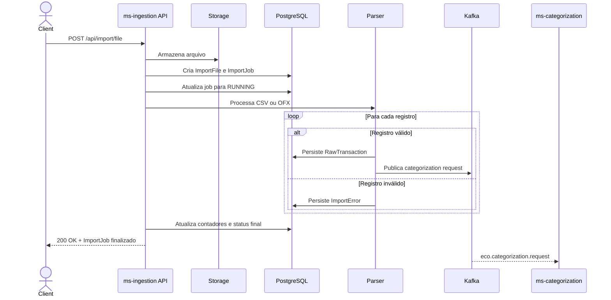
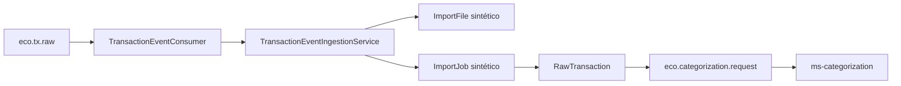

# ms-ingestion — EcoFy

> Microsserviço responsável pela ingestão de transações financeiras por arquivos CSV/OFX e eventos Kafka.

> 🇬🇧 **English summary first.**
> 🇧🇷 **Documentação técnica completa em Português abaixo.**

---

## 🇬🇧 English Summary

### Responsibility

The `ms-ingestion` service is responsible for receiving and normalizing financial transactions before they enter the EcoFy categorization pipeline.

It supports two ingestion channels:

* CSV and OFX file uploads.
* Transaction batches received through Kafka.

For each import, the service creates an `ImportJob`, persists valid transactions as `RawTransaction`, records line-level errors and publishes categorization requests to `ms-categorization`.

### Technology stack

* Java 25
* Spring Boot 4
* Spring Security
* OAuth2 Resource Server
* PostgreSQL
* Flyway
* Apache Kafka
* Local file storage
* Maven
* JUnit 5
* Mockito

### Architecture

The service follows Hexagonal Architecture:

```text
core/domain
core/application
core/port/in
core/port/out
adapters/in
adapters/out
config
```

### Service configuration

| Property     | Value            |
| ------------ | ---------------- |
| Port         | `8082`           |
| Context path | `/ingestion`     |
| Database     | PostgreSQL       |
| Messaging    | Apache Kafka     |
| File storage | Local filesystem |

Local base URL:

```text
http://localhost:8082/ingestion
```

### Main endpoints

| Method | Full endpoint                     | Protection          | Description                             |
| ------ | --------------------------------- | ------------------- | --------------------------------------- |
| `POST` | `/ingestion/api/import/file`      | JWT in production   | Uploads and processes a CSV or OFX file |
| `GET`  | `/ingestion/api/import/jobs/{id}` | JWT in production   | Returns import status and counters      |
| `GET`  | `/ingestion/actuator/health`      | Public/configurable | Reports service health                  |
| `GET`  | `/ingestion/actuator/info`        | Public/configurable | Reports service information             |

### Import behavior

File imports are currently processed synchronously.

The upload endpoint:

1. Stores the file and metadata.
2. Creates an `ImportJob`.
3. Parses the file.
4. Persists valid transactions.
5. Records invalid lines as `ImportError`.
6. Publishes categorization requests.
7. Returns the finalized job with HTTP `200 OK`.

### Kafka integration

The service consumes:

* `eco.tx.raw`

The service publishes:

* `eco.categorization.request`
* `eco.ingestion.transaction.imported`
* `eco.ingestion.import-job.status-changed`

### Security

The API is protected according to the active profile.

* Development and test environments may enable `permit-all`.
* Production requires a valid JWT.
* JWT validation uses the JWKS endpoint exposed by `ms-auth`.

Main environment variable:

```text
ING_SECURITY_PERMIT_ALL
```

### Known limitations

* File processing is synchronous.
* Uploaded files are loaded into memory.
* The CSV parser is custom and does not use Apache Commons CSV.
* `RawTransaction` does not currently contain `userId`.
* Kafka consumers do not yet use a complete retry and DLT strategy.
* Kafka integration tests with a real broker are still pending.

---

# 🇧🇷 Documentação técnica

## 1. Visão geral

O `ms-ingestion` é o ponto de entrada das transações financeiras no ecossistema EcoFy.

O serviço recebe dados por:

* Upload de arquivos CSV.
* Upload de arquivos OFX.
* Eventos Kafka.

A partir desses dados, o serviço:

1. Cria um registro de importação.
2. Processa as transações recebidas.
3. Persiste as transações válidas.
4. Registra os erros encontrados.
5. Atualiza o status e os contadores da importação.
6. Publica as transações para categorização.

O `ms-ingestion` não define a categoria financeira final da transação. Essa responsabilidade pertence ao `ms-categorization`.

---

## 2. Stack tecnológica

| Tecnologia             | Responsabilidade                      |
| ---------------------- | ------------------------------------- |
| Java 25                | Linguagem principal                   |
| Spring Boot 4          | Framework da aplicação                |
| Spring Security        | Autenticação e autorização            |
| OAuth2 Resource Server | Validação de tokens JWT               |
| PostgreSQL             | Persistência relacional               |
| Flyway                 | Versionamento do schema               |
| Apache Kafka           | Integração assíncrona                 |
| Local filesystem       | Armazenamento inicial dos arquivos    |
| Maven Wrapper          | Build e gerenciamento de dependências |
| JUnit 5                | Testes automatizados                  |
| Mockito                | Testes unitários isolados             |

---

## 3. Arquitetura

O serviço segue Arquitetura Hexagonal, separando o domínio das tecnologias utilizadas para receber, persistir e publicar dados.

Estrutura conceitual:

```text
src/main/java/br/com/ecofy/ms_ingestion
├── core
│   ├── domain
│   ├── application
│   └── port
├── adapters
│   ├── in
│   └── out
└── config
```

### Responsabilidade das camadas

| Camada             | Responsabilidade                                    |
| ------------------ | --------------------------------------------------- |
| `core/domain`      | Entidades, enums, value objects e regras de negócio |
| `core/application` | Serviços responsáveis pelos fluxos de ingestão      |
| `core/port/in`     | Casos de uso disponibilizados pela aplicação        |
| `core/port/out`    | Contratos de persistência, storage e mensageria     |
| `adapters/in`      | Controllers REST e consumers Kafka                  |
| `adapters/out`     | Persistência, storage e publicação Kafka            |
| `config`           | Segurança, Kafka, propriedades e infraestrutura     |

---

## 4. Configuração do serviço

| Configuração | Valor padrão    |
| ------------ | --------------- |
| Porta        | `8082`          |
| Context path | `/ingestion`    |
| Banco        | PostgreSQL      |
| Mensageria   | Apache Kafka    |
| Storage      | Diretório local |

URL base local:

```text
http://localhost:8082/ingestion
```

Exemplo de endpoint completo:

```text
http://localhost:8082/ingestion/api/import/file
```

---

## 5. Responsabilidades funcionais

### 5.1 Upload de arquivos

O serviço aceita arquivos financeiros nos formatos:

* CSV.
* OFX.

Para cada upload, são criados:

* Metadados do arquivo.
* Um `ImportJob`.
* Registros `RawTransaction`.
* Registros `ImportError`, quando necessário.

### 5.2 Ingestão por eventos

O serviço também recebe lotes de transações pelo tópico Kafka `eco.tx.raw`.

Para preservar as regras relacionais do banco, a ingestão por eventos cria:

* Um arquivo sintético com origem `EVENT`.
* Um `ImportJob` sintético.
* As transações associadas ao job criado.

### 5.3 Rastreamento da importação

Cada processamento é acompanhado por um `ImportJob`, que mantém:

* Status atual.
* Quantidade total de registros.
* Quantidade de registros processados.
* Quantidade de sucessos.
* Quantidade de erros.

### 5.4 Publicação para categorização

Cada transação persistida com sucesso gera uma solicitação de categorização para o `ms-categorization`.

---

## 6. Fluxo de importação de arquivo

O processamento atual é síncrono.



### Etapas

1. O cliente envia um arquivo multipart.
2. O serviço valida o arquivo recebido.
3. O arquivo e seus metadados são armazenados.
4. Um `ImportJob` é criado com status inicial.
5. O status é alterado para `RUNNING`.
6. O parser processa cada registro.
7. Transações válidas são persistidas.
8. Linhas inválidas são registradas como `ImportError`.
9. Eventos de categorização são publicados.
10. Os contadores são atualizados.
11. O job recebe o status final.
12. A API retorna HTTP `200 OK`.

---

## 7. Fluxo de ingestão Kafka

O consumer `TransactionEventConsumer` consome o tópico:

```text
eco.tx.raw
```

O processamento é realizado por `TransactionEventIngestionService`.

### Comportamento

Para cada lote recebido:

1. Cria um `ImportFile` sintético.
2. Define a origem como `EVENT`.
3. Cria um `ImportJob`.
4. Associa todas as transações ao job.
5. Persiste as transações válidas.
6. Publica solicitações de categorização.
7. Atualiza os contadores e o status do job.

Essa associação garante que toda `RawTransaction` referencie um `ImportJob` existente, respeitando as constraints do banco.



---

## 8. Endpoints

Os paths abaixo são relativos ao context path `/ingestion`.

### 8.1 Importar arquivo

```http
POST /api/import/file
```

Endpoint completo:

```text
POST /ingestion/api/import/file
```

Proteção:

* Desenvolvimento/teste: configurável.
* Produção: JWT obrigatório.

Content type:

```http
multipart/form-data
```

Exemplo:

```bash
curl -i -X POST \
  "http://localhost:8082/ingestion/api/import/file" \
  -H "Authorization: Bearer {accessToken}" \
  -F "file=@transactions.csv"
```

### 8.2 Consultar importação

```http
GET /api/import/jobs/{id}
```

Endpoint completo:

```text
GET /ingestion/api/import/jobs/{id}
```

Exemplo:

```bash
curl -i \
  "http://localhost:8082/ingestion/api/import/jobs/{jobId}" \
  -H "Authorization: Bearer {accessToken}"
```

A resposta contém o status atual e os contadores persistidos.

### 8.3 Actuator

| Método | Endpoint completo            | Descrição                |
| ------ | ---------------------------- | ------------------------ |
| `GET`  | `/ingestion/actuator/health` | Estado de saúde          |
| `GET`  | `/ingestion/actuator/info`   | Informações da aplicação |

---

## 9. Contrato síncrono

O endpoint de upload retorna:

```http
200 OK
```

A resposta representa um job já processado, com:

* Status final.
* Total de registros.
* Total processado.
* Quantidade de sucessos.
* Quantidade de erros.

O endpoint não retorna `202 Accepted`, pois o processamento não é delegado atualmente a uma fila, executor ou worker assíncrono.

Um contrato assíncrono futuro deverá:

1. Persistir o arquivo e o job.
2. Retornar `202 Accepted`.
3. Processar o job fora da thread HTTP.
4. Permitir acompanhamento pelo endpoint de consulta.
5. Controlar retry e concorrência.
6. Garantir processamento idempotente.

---

## 10. Ciclo de vida do `ImportJob`

Fluxo principal:

```text
PENDING
   ↓
RUNNING
   ↓
COMPLETED | COMPLETED_WITH_ERRORS | FAILED
```

### Status

| Status                  | Significado                                                        |
| ----------------------- | ------------------------------------------------------------------ |
| `PENDING`               | Job criado e ainda não iniciado                                    |
| `RUNNING`               | Arquivo ou lote em processamento                                   |
| `COMPLETED`             | Todos os registros foram processados com sucesso                   |
| `COMPLETED_WITH_ERRORS` | Existem transações válidas e erros parciais                        |
| `FAILED`                | O job não produziu transações válidas ou excedeu o limite de erros |

### Critérios de finalização

#### `COMPLETED`

Utilizado quando:

* Existem registros válidos.
* Nenhuma linha produziu erro.

#### `COMPLETED_WITH_ERRORS`

Utilizado quando:

* Existem registros válidos.
* Existem erros rastreáveis.
* O limite máximo de erros não foi excedido.

#### `FAILED`

Utilizado quando:

* Nenhuma transação válida foi produzida.
* O arquivo possui erro estrutural.
* A quantidade de erros excede `ecofy.ingestion.max-errors-per-job`.
* O processamento sofre uma falha impeditiva.

---

## 11. Contadores do job

Os contadores são persistidos antes da finalização.

| Contador           | Significado                                   |
| ------------------ | --------------------------------------------- |
| `totalRecords`     | Total de linhas ou registros considerados     |
| `processedRecords` | Total de registros efetivamente processados   |
| `successCount`     | Total de transações persistidas com sucesso   |
| `errorCount`       | Total de erros registrados como `ImportError` |

Relação esperada em um processamento concluído:

```text
successCount + errorCount = totalRecords
```

A igualdade pode variar quando existirem linhas ignoradas pelo parser, como cabeçalhos ou linhas em branco, conforme a implementação do formato.

---

## 12. Formato CSV

### 12.1 Estrutura esperada

```csv
date;description;amount;currency
2026-01-15;Coffee;12.50;BRL
2026-01-16;"Book; hardcover";-30.00;BRL
```

### 12.2 Colunas

| Coluna        | Obrigatória | Formato                             |
| ------------- | ----------: | ----------------------------------- |
| `date`        |         Sim | `yyyy-MM-dd`                        |
| `description` |         Sim | Texto                               |
| `amount`      |         Sim | Valor decimal                       |
| `currency`    |         Não | Código de três letras; padrão `BRL` |

### 12.3 Regras de parsing

* Delimitador: `;`.
* Aspas duplas são aceitas.
* O delimitador pode aparecer dentro de campos entre aspas.
* `amount` pode utilizar ponto ou vírgula decimal.
* `currency` é opcional.
* A moeda padrão é `BRL`.
* A primeira linha contendo `date` é tratada como cabeçalho.
* Linhas em branco são ignoradas.
* Linhas inválidas geram `ImportError`.

Exemplo com vírgula decimal:

```csv
date;description;amount;currency
2026-01-15;Supermercado;142,90;BRL
```

---

## 13. Formato OFX

O parser identifica blocos:

```text
<STMTTRN>
```

Principais campos utilizados:

| Campo OFX  | Finalidade             |
| ---------- | ---------------------- |
| `TRNAMT`   | Valor da transação     |
| `DTPOSTED` | Data da transação      |
| `NAME`     | Nome ou descrição      |
| `MEMO`     | Descrição complementar |
| `FITID`    | Identificador externo  |

Estrutura simplificada:

```ofx
<STMTTRN>
    <TRNTYPE>DEBIT
    <DTPOSTED>20260115120000
    <TRNAMT>-42.90
    <FITID>transaction-001
    <NAME>Supermarket
    <MEMO>Monthly purchase
</STMTTRN>
```

Erros estruturais que impedem a interpretação do documento podem finalizar o job como `FAILED`.

---

## 14. Política de erros

O serviço diferencia erros de registro e erros estruturais.

### 14.1 Erro por linha ou transação

Exemplos:

* Data inválida.
* Valor inválido.
* Campo obrigatório ausente.
* Moeda inválida.
* Linha CSV malformada.

Comportamento:

1. Cria um `ImportError`.
2. Incrementa `errorCount`.
3. Continua o processamento.
4. Permite importação parcial.

### 14.2 Erro estrutural

Exemplos:

* Arquivo ilegível.
* Formato não reconhecido.
* Estrutura OFX inválida.
* Falha de storage.
* Falha impeditiva de persistência.

Comportamento:

1. Interrompe o processamento.
2. Atualiza o job para `FAILED`.
3. Registra a falha nos logs.
4. Retorna ou propaga o erro padronizado.

### 14.3 Limite de erros

O limite é configurado por:

```text
ecofy.ingestion.max-errors-per-job
```

Variável de ambiente:

```text
ING_MAX_ERRORS_PER_JOB
```

Valor padrão:

```text
100
```

Ao exceder o limite, o job é finalizado como `FAILED`.

---

## 15. Evento para categorização

As transações válidas são publicadas em:

```text
eco.categorization.request
```

Chave Kafka:

```text
transactionId
```

Payload:

```json
{
  "transactionId": "00000000-0000-0000-0000-000000000001",
  "importJobId": "00000000-0000-0000-0000-000000000002",
  "description": "Supermarket",
  "amount": 42.90,
  "currency": "BRL",
  "transactionDate": "2026-01-15",
  "sourceType": "FILE_CSV"
}
```

### Campos

| Campo             | Descrição                             |
| ----------------- | ------------------------------------- |
| `transactionId`   | Identificador da transação persistida |
| `importJobId`     | Identificador do job de origem        |
| `description`     | Descrição original                    |
| `amount`          | Valor monetário                       |
| `currency`        | Código da moeda                       |
| `transactionDate` | Data da transação                     |
| `sourceType`      | Origem da transação                   |

Valores possíveis de origem podem incluir:

```text
FILE_CSV
FILE_OFX
EVENT
```

O contrato atual não envia `userId`, pois esse campo ainda não faz parte do modelo `RawTransaction`.

---

## 16. Tópicos Kafka

As propriedades Kafka utilizam o prefixo:

```text
ecofy.ingestion.kafka
```

| Propriedade                        | Valor padrão                              | Direção | Finalidade                        |
| ---------------------------------- | ----------------------------------------- | ------- | --------------------------------- |
| `transaction-event-topic`          | `eco.tx.raw`                              | Consome | Ingestão de transações por evento |
| `topics.transaction-imported`      | `eco.ingestion.transaction.imported`      | Publica | Auditoria de transação importada  |
| `topics.import-job-status-changed` | `eco.ingestion.import-job.status-changed` | Publica | Alteração de status do job        |
| `topics.categorization-request`    | `eco.categorization.request`              | Publica | Solicitação de categorização      |

Estrutura de configuração:

```yaml
ecofy:
  ingestion:
    kafka:
      transaction-event-topic: eco.tx.raw
      topics:
        transaction-imported: eco.ingestion.transaction.imported
        import-job-status-changed: eco.ingestion.import-job.status-changed
        categorization-request: eco.categorization.request
```

---

## 17. Segurança

O serviço atua como OAuth2 Resource Server.

A validação JWT utiliza o endpoint JWKS do `ms-auth`.

Configuração:

```text
JWT_JWKS_URI=http://localhost:8081/auth/.well-known/jwks.json
```

### 17.1 Segurança por profile

| Profile           | `permit-all` | Banco                | Kafka                   |
| ----------------- | -----------: | -------------------- | ----------------------- |
| `default` / `dev` |       `true` | PostgreSQL local     | Broker local            |
| `test`            |       `true` | H2 em memória        | Listeners desabilitados |
| `prod`            |      `false` | Configuração externa | SASL/SSL                |

### 17.2 Propriedade de segurança

```text
ecofy.ingestion.security.permit-all
```

Variável de ambiente:

```text
ING_SECURITY_PERMIT_ALL
```

Em produção:

```env
ING_SECURITY_PERMIT_ALL=false
```

O Resource Server permanece configurado em todos os profiles. A propriedade `permit-all` apenas controla se as rotas de importação exigem autenticação.

---

## 18. Persistência

O serviço utiliza PostgreSQL com Flyway.

Principais agregados persistidos:

* `ImportFile`.
* `ImportJob`.
* `RawTransaction`.
* `ImportError`.

Configuração local padrão:

```text
jdbc:postgresql://localhost:5434/ecofy_ingestion
```

As alterações de schema devem ser realizadas por novas migrations.

Migrations já aplicadas em ambientes compartilhados não devem ser modificadas.

---

## 19. Storage

Os arquivos são armazenados localmente por padrão.

Variável:

```text
ING_STORAGE_BASE_PATH
```

Valor padrão:

```text
./data/ms-ingestion
```

Exemplo:

```env
ING_STORAGE_BASE_PATH=./data/ms-ingestion
```

O armazenamento local é adequado para desenvolvimento, mas possui limitações em ambientes distribuídos.

Para produção, pode ser necessário adotar um storage compartilhado ou serviço de objetos, preservando a abstração definida pela porta de saída.

---

## 20. Variáveis de ambiente

| Variável                  | Valor padrão em desenvolvimento                    | Descrição                          |
| ------------------------- | -------------------------------------------------- | ---------------------------------- |
| `DB_URL`                  | `jdbc:postgresql://localhost:5434/ecofy_ingestion` | URL JDBC                           |
| `DB_USER`                 | Configuração local                                 | Usuário do PostgreSQL              |
| `DB_PASS`                 | Configuração local                                 | Senha do PostgreSQL                |
| `KAFKA_BOOTSTRAP_SERVERS` | `localhost:19092`                                  | Endereço do Kafka                  |
| `JWT_JWKS_URI`            | `http://localhost:8081/auth/.well-known/jwks.json` | JWKS do `ms-auth`                  |
| `ING_SECURITY_PERMIT_ALL` | `true`                                             | Libera as rotas em desenvolvimento |
| `ING_MAX_ERRORS_PER_JOB`  | `100`                                              | Limite de erros por job            |
| `ING_TOPIC_TX_EVENT`      | `eco.tx.raw`                                       | Tópico consumido                   |
| `ING_TOPIC_CATEGORIZE`    | `eco.categorization.request`                       | Tópico de categorização            |
| `ING_STORAGE_BASE_PATH`   | `./data/ms-ingestion`                              | Diretório de arquivos              |

Exemplo local:

```env
DB_URL=jdbc:postgresql://localhost:5434/ecofy_ingestion
DB_USER=postgres
DB_PASS=postgres

KAFKA_BOOTSTRAP_SERVERS=localhost:19092
JWT_JWKS_URI=http://localhost:8081/auth/.well-known/jwks.json

ING_SECURITY_PERMIT_ALL=true
ING_MAX_ERRORS_PER_JOB=100

ING_TOPIC_TX_EVENT=eco.tx.raw
ING_TOPIC_CATEGORIZE=eco.categorization.request

ING_STORAGE_BASE_PATH=./data/ms-ingestion
```

> Credenciais e segredos de produção não devem ser versionados.

---

## 21. Execução local

### 21.1 Pré-requisitos

* JDK 25.
* PostgreSQL local ou Docker.
* Kafka local para testar eventos.
* Porta `8082` disponível.
* `ms-auth` acessível quando JWT for obrigatório.
* Diretório de storage com permissão de escrita.

### 21.2 Executar com Maven Wrapper

Linux ou macOS:

```bash
./mvnw spring-boot:run
```

Windows:

```powershell
.\mvnw.cmd spring-boot:run
```

### 21.3 Verificar a aplicação

```bash
curl -i \
  "http://localhost:8082/ingestion/actuator/health"
```

Resposta esperada:

```json
{
  "status": "UP"
}
```

---

## 22. Build e testes

### 22.1 Executar os testes

Linux ou macOS:

```bash
./mvnw clean test
```

Windows:

```powershell
.\mvnw.cmd clean test
```

### 22.2 Executar com o profile de teste

```bash
./mvnw clean test -Dspring.profiles.active=test
```

### 22.3 Gerar o pacote

```bash
./mvnw clean package
```

O artefato será gerado em:

```text
target/
```

### 22.4 Executar o JAR

```bash
java -jar target/*.jar
```

---

## 23. Estratégia de testes

A suíte atual inclui:

* Testes unitários.
* JUnit 5.
* Mockito.
* Testes de integração com H2.
* Teste de inicialização do contexto.
* Kafka desabilitado durante testes que não exigem mensageria.

Ainda são recomendados testes de integração para:

* Upload multipart real.
* Parsing de arquivos grandes.
* Persistência com PostgreSQL.
* Migrations Flyway.
* Consumer de `eco.tx.raw`.
* Publicação de `eco.categorization.request`.
* Retry Kafka.
* DLT.
* Concorrência de jobs.
* Falhas de storage.
* Limites de tamanho do upload.

---

## 24. Observabilidade

O serviço disponibiliza endpoints do Spring Boot Actuator.

Principais endpoints:

```text
/ingestion/actuator/health
/ingestion/actuator/info
```

A observabilidade deve acompanhar:

* Jobs criados.
* Jobs concluídos.
* Jobs concluídos com erros.
* Jobs com falha.
* Quantidade de transações importadas.
* Quantidade de linhas inválidas.
* Tempo de processamento por arquivo.
* Tamanho dos arquivos.
* Falhas de parsing.
* Falhas de storage.
* Falhas de persistência.
* Falhas de publicação Kafka.
* Lag do consumer.
* Correlation ID e MDC.

---

## 25. Limitações conhecidas

### 25.1 Processamento síncrono

O upload permanece conectado até o término do processamento.

Impactos possíveis:

* Timeout em arquivos grandes.
* Maior consumo de threads HTTP.
* Resposta mais lenta.
* Dificuldade de controle de concorrência.

### 25.2 Arquivo carregado em memória

O processamento atual não utiliza streaming completo de upload, storage e parsing.

Arquivos grandes podem aumentar o consumo de memória.

### 25.3 Parser CSV próprio

O parser suporta delimitadores, aspas e erros por linha, mas não utiliza uma biblioteca especializada como Apache Commons CSV.

### 25.4 Ausência de `userId`

O modelo `RawTransaction` ainda não possui `userId`.

Consequentemente, o evento enviado ao `ms-categorization` não identifica diretamente o proprietário da transação.

### 25.5 Ausência de DLT

Falhas definitivas de consumo Kafka ainda não são encaminhadas para uma Dead Letter Topic.

### 25.6 Retry Kafka incompleto

A estratégia de retry precisa ser consolidada para distinguir:

* Payload inválido.
* Falha temporária.
* Falha permanente.
* Evento duplicado.

### 25.7 Storage local

O filesystem local não é compartilhado entre múltiplas instâncias.

### 25.8 Validação de arquivo limitada

Content type, extensão e conteúdo real ainda precisam de validação mais rigorosa.

### 25.9 Actuator

Os endpoints administrativos precisam de hardening específico para produção.

---

## 26. Próximos passos

1. Implementar processamento assíncrono real.
2. Retornar `202 Accepted` após enfileirar o job.
3. Criar worker dedicado para processamento.
4. Implementar streaming do upload ao parser.
5. Definir limites de tamanho por arquivo.
6. Migrar o parser CSV para uma biblioteca consolidada.
7. Adicionar `userId` ao domínio de transações.
8. Propagar `userId` no evento de categorização.
9. Implementar retry com backoff.
10. Implementar Dead Letter Topic.
11. Adicionar idempotência ao consumer Kafka.
12. Adicionar correlation ID e MDC.
13. Criar métricas específicas do domínio.
14. Implementar testes Kafka com broker real.
15. Implementar testes PostgreSQL com Testcontainers.
16. Avaliar storage de objetos para produção.
17. Validar MIME type e assinatura dos arquivos.
18. Restringir Actuator em produção.
19. Documentar versionamento dos eventos.
20. Definir políticas de retenção, replay e reprocessamento.

---

## 27. Resumo de implementação

| Recurso                       | Situação      |
| ----------------------------- | ------------- |
| Upload CSV                    | Implementado  |
| Upload OFX                    | Implementado  |
| Parsing por registro          | Implementado  |
| Importação parcial            | Implementada  |
| Registro de `ImportError`     | Implementado  |
| Ciclo de vida de `ImportJob`  | Implementado  |
| Contadores de processamento   | Implementados |
| Ingestão por Kafka            | Implementada  |
| Publicação para categorização | Implementada  |
| Eventos de auditoria          | Implementados |
| Segurança JWT                 | Implementada  |
| Segurança por profile         | Implementada  |
| Storage local                 | Implementado  |
| Processamento assíncrono      | Pendente      |
| Streaming completo            | Pendente      |
| `userId` em `RawTransaction`  | Pendente      |
| Retry Kafka robusto           | Pendente      |
| Dead Letter Topic             | Pendente      |
| Testes com broker real        | Pendentes     |
| Observabilidade completa      | Parcial       |

---

## 28. Licença

Este microsserviço faz parte do projeto **EcoFy**.

Consulte o repositório principal para informações sobre:

* Arquitetura completa.
* Execução integrada.
* Contratos compartilhados.
* Infraestrutura.
* Fluxos Kafka.
* Segurança.
* Licença do projeto.
