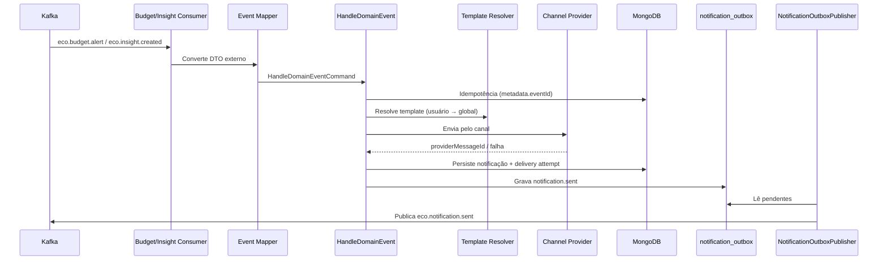

# ms-notification — EcoFy

> Microsserviço responsável pelas notificações multicanal (EMAIL/WHATSAPP/PUSH) do ecossistema EcoFy, a partir de eventos de domínio.

> 🇬🇧 **English summary first.**
> 🇧🇷 **Documentação técnica completa em Português abaixo.**

---

## 🇬🇧 English Summary

### Responsibility

The `ms-notification` service delivers **multichannel notifications** from domain events.

It is responsible for:

* Consuming `BUDGET_ALERT` and `INSIGHT_CREATED` events.
* Resolving templates per event and channel.
* Sending through EMAIL, WHATSAPP and PUSH channels.
* Persisting notifications and delivery attempts.
* Applying idempotency (HTTP and Kafka).
* Retrying delivery with backoff.
* Publishing `eco.notification.sent` through a Transactional Outbox.

### Technology stack

* Java 25
* Spring Boot 4
* Spring Security
* OAuth2 Resource Server
* MongoDB
* Apache Kafka
* Transactional Outbox
* Maven
* JUnit 5
* Mockito

### Architecture

The service follows Hexagonal Architecture:

```text
core/domain
core/application
core/port/in
core/port/out
adapters/in
adapters/out
config
```

### Service configuration

| Property       | Value             |
| -------------- | ----------------- |
| Port           | `8086`            |
| Context path   | `/notification`   |
| Database       | MongoDB           |
| Messaging      | Apache Kafka      |
| Consumer group | `ms-notification` |

Local base URL:

```text
http://localhost:8086/notification
```

### Main endpoints

The paths below are relative to the `/notification` context path.

| Method     | Endpoint                                    | Protection        | Description                     |
| ---------- | ------------------------------------------- | ----------------- | ------------------------------- |
| `POST`     | `/api/notification/v1/notifications`        | JWT in production | Manual send (idempotent)        |
| `POST`     | `/api/notification/v1/notifications/resend` | JWT in production | Resend                          |
| `GET`      | `/api/notification/v1/notifications`        | JWT in production | List by user                    |
| `POST`/`GET` | `/api/notification/v1/templates`          | JWT in production | Template CRUD + preview         |
| `GET`      | `/actuator/health`                          | Public            | Reports service health          |
| `GET`      | `/actuator/info`                            | Public            | Reports service information     |

### Channels and providers

Console adapters are used in `dev`/`test` (no external I/O). Real HTTP providers are active in `prod`/`sandbox`, protected by a circuit breaker, and enabled per channel through configuration.

### Kafka integration

The service consumes:

```text
eco.budget.alert
eco.insight.created
```

The service publishes (through the Outbox):

```text
eco.notification.sent
```

Consumer failures use retry with backoff. Exhausted messages are forwarded to `<topic>.dlt`.

### Security

* Actuator, Swagger and OpenAPI are public.
* Business endpoints require a valid JWT in production.
* `permit-all` eases local testing.
* JWT validation uses the JWKS endpoint exposed by `ms-auth`.

Main environment variable:

```text
NTF_SECURITY_PERMIT_ALL
```

### Known limitations

* Real provider integrations require per-environment credentials (disabled by default).
* The `ms-users` profile client is disabled by default and returns synthetic contacts in dev/test.
* Retry delay is calculated/logged; a fully scheduled backoff is still a next step.
* MDC/correlation from Kafka headers on consumers is still pending.

---

# 🇧🇷 Documentação técnica

## 1. Visão geral

O `ms-notification` entrega **notificações multicanal** a partir de eventos de domínio do ecossistema EcoFy.

O serviço consome eventos publicados por `ms-budgeting` (`eco.budget.alert`) e `ms-insights` (`eco.insight.created`), resolve templates por evento/canal, envia pelos canais EMAIL/WHATSAPP/PUSH, persiste as notificações e tentativas de entrega no MongoDB, aplica idempotência e publica `eco.notification.sent`.

A publicação do evento de saída usa uma implementação de **Transactional Outbox**, enquanto falhas no consumo são tratadas por retry e Dead Letter Topic.

---

## 2. Stack tecnológica

| Tecnologia             | Responsabilidade                      |
| ---------------------- | ------------------------------------- |
| Java 25                | Linguagem principal                   |
| Spring Boot 4          | Framework da aplicação                |
| Spring Security        | Autenticação e autorização            |
| OAuth2 Resource Server | Validação de tokens JWT               |
| MongoDB                | Persistência documental               |
| Apache Kafka           | Integração assíncrona                 |
| Transactional Outbox   | Publicação confiável de eventos       |
| Maven Wrapper          | Build e gerenciamento de dependências |
| JUnit 5                | Testes automatizados                  |
| Mockito                | Testes unitários isolados             |

---

## 3. Arquitetura

O serviço segue Arquitetura Hexagonal, mantendo o domínio de notificações independente das tecnologias de transporte, persistência e mensageria.

Estrutura conceitual:

```text
src/main/java/br/com/ecofy/ms_notification
├── core
│   ├── domain
│   ├── application
│   └── port
├── adapters
│   ├── in
│   └── out
└── config
```

### Responsabilidade das camadas

| Camada             | Responsabilidade                                             |
| ------------------ | ------------------------------------------------------------ |
| `core/domain`      | Notificações, templates, tentativas e regras de entrega      |
| `core/application` | Use cases de envio, reenvio, templates e handling de eventos |
| `core/port/in`     | Casos de uso expostos pela aplicação                         |
| `core/port/out`    | Persistência, providers, idempotência e Outbox               |
| `adapters/in`      | Controllers REST e consumers Kafka                           |
| `adapters/out`     | MongoDB, providers HTTP/console, Outbox e cliente de perfil  |
| `config`           | Segurança, Kafka, providers, circuit breaker e infraestrutura|

---

## 4. Configuração do serviço

| Configuração   | Valor padrão      |
| -------------- | ----------------- |
| Porta          | `8086`            |
| Context path   | `/notification`   |
| Banco          | MongoDB           |
| Mensageria     | Apache Kafka      |
| Consumer group | `ms-notification` |

URL base local:

```text
http://localhost:8086/notification
```

Exemplo de endpoint completo:

```text
http://localhost:8086/notification/api/notification/v1/notifications
```

---

## 5. Responsabilidades funcionais

O serviço é responsável por:

* Consumir eventos `eco.budget.alert` e `eco.insight.created`.
* Resolver templates por evento/canal (fallback global + override por usuário).
* Enviar por canal (EMAIL/WHATSAPP/PUSH) via providers.
* Persistir notificações e tentativas de entrega.
* Aplicar idempotência (HTTP e Kafka).
* Aplicar política de retry.
* Publicar `eco.notification.sent` para observabilidade/auditoria.

---

## 6. Canais e providers

| Canal      | Port                  | Adapter console (dev/test) | Adapter real (prod/sandbox) |
| ---------- | --------------------- | -------------------------- | --------------------------- |
| EMAIL      | `EmailSenderPort`     | `EmailProviderAdapter`     | `HttpEmailProviderAdapter`  |
| WHATSAPP   | `WhatsAppSenderPort`  | `WhatsAppProviderAdapter`  | `HttpWhatsAppProviderAdapter` |
| PUSH       | `PushSenderPort`      | `PushProviderAdapter`      | `HttpPushProviderAdapter`   |

Os adapters de console (`@Profile("!prod & !sandbox")`) **simulam** o envio: geram um `providerMessageId` sintético e logam, sem I/O externo. Os adapters HTTP reais ficam ativos em `prod`/`sandbox`, são habilitados por canal (`ecofy.notification.providers.*.enabled`) e protegidos por um **circuit breaker** (`ProviderCircuitBreaker`).

> As credenciais dos providers reais (`base-url`, `api-key`) devem ser informadas por ambiente, **nunca** versionadas.

---

## 7. Endpoints

Os paths abaixo são relativos ao context path `/notification`.

| Método | Path                                        | Auth (prod) | Descrição                                        |
| ------ | ------------------------------------------- | ----------- | ------------------------------------------------ |
| `POST` | `/api/notification/v1/notifications`        | JWT         | Envio manual (idempotente via `Idempotency-Key`) |
| `POST` | `/api/notification/v1/notifications/resend` | JWT         | Reenvio                                          |
| `GET`  | `/api/notification/v1/notifications?userId=&limit=` | JWT | Lista por usuário (limit default 50, máx 200)    |
| `POST` | `/api/notification/v1/templates`            | JWT         | Cria template                                    |
| `GET`  | `/api/notification/v1/templates/{id}`       | JWT         | Busca template                                   |
| `POST` | `/api/notification/v1/templates/preview`    | JWT         | Preview de template                              |

### 7.1 Actuator

| Método | Endpoint completo                | Descrição                |
| ------ | -------------------------------- | ------------------------ |
| `GET`  | `/notification/actuator/health`  | Estado de saúde          |
| `GET`  | `/notification/actuator/info`    | Informações da aplicação |
| `GET`  | `/notification/actuator/prometheus` | Métricas Prometheus   |

---

## 8. Fluxo de consumo (Kafka)



Os adapters convertem os DTOs externos (`BudgetAlertEventMessage`, `InsightCreatedEventMessage`) em `HandleDomainEventCommand` (comando interno do core). `userId` é obrigatório (o mapper lança erro se ausente); `metadata.eventId` vira a chave de idempotência.

---

## 9. Templates

* Resolução: template do usuário (`ownerUserId`) → fallback global (`ownerUserId = null`), ambos ativos.
* Engine `SIMPLE` substitui placeholders `{{chave}}` pelo payload.
* EMAIL exige `subjectTemplate`.
* Criação/consulta/preview via use cases (`CreateTemplateUseCase`, `GetTemplateUseCase`, `PreviewTemplateUseCase`) — o controller não acessa o adapter Mongo direto.

---

## 10. Idempotência e retry

### Idempotência

`IdempotencyPort.tryAcquire(key)`; habilitável por `ecofy.notification.idempotency.enabled`, TTL por `...idempotency.ttl`. Send/resend adquirem a chave antes de processar (`409` em conflito).

### Retry

`RetryPolicyService` (`max-attempts`/`base-backoff`/`multiplier`/`max-backoff`) integrado ao fluxo de envio: em falha do provider, registra a tentativa, atualiza status e re-tenta até o máximo; esgotado, marca `FAILED`. O backoff é calculado e logado, com **teto** configurável.

| Propriedade    | Valor padrão | Finalidade                |
| -------------- | ------------ | ------------------------- |
| `max-attempts` | `3`          | Tentativas de entrega     |
| `base-backoff` | `PT3S`       | Backoff inicial           |
| `multiplier`   | `2.0`        | Fator do backoff          |
| `max-backoff`  | `PT5M`       | Teto do backoff           |

---

## 11. Confiabilidade e Transactional Outbox

A publicação de `eco.notification.sent` usa **Transactional Outbox**: o evento é gravado na collection `notification_outbox` junto ao processamento, e o `NotificationOutboxPublisher` o entrega ao broker posteriormente (`scheduling.enabled`, `outbox.poll-interval-ms`).

Falhas de consumo são tratadas pelo `KafkaConsumerConfig`, que configura retry com backoff e um `DeadLetterPublishingRecoverer` encaminhando mensagens irrecuperáveis para `<topic>.dlt`.

---

## 12. Tópicos Kafka

Prefixo `ecofy.notification.topics`.

| Propriedade         | Valor padrão            | Direção | Finalidade                 |
| ------------------- | ----------------------- | ------- | -------------------------- |
| `budget-alert`      | `eco.budget.alert`      | Consome | Alertas de orçamento       |
| `insight-created`   | `eco.insight.created`   | Consome | Insights gerados           |
| `notification-sent` | `eco.notification.sent` | Publica | Auditoria de entrega       |

### Contrato `BUDGET_ALERT` (do ms-budgeting) — `BudgetAlertEventMessage`

`userId` (obrigatório), `budgetId`, `categoryId`, `limitAmount`, `consumedAmount`, `consumedPct`, `severity`, `metadata{eventId,correlationId,occurredAt,source}`.

### Contrato `INSIGHT_CREATED` (do ms-insights) — `InsightCreatedEventMessage`

`userId` (obrigatório), `insightId`, `insightType`, `periodStart`, `periodEnd`, `metadata`.

---

## 13. Segurança

O serviço atua como OAuth2 Resource Server. A validação JWT utiliza o endpoint JWKS do `ms-auth`.

### 13.1 Segurança por profile

| Profile           | `permit-all` | JWT em `/api/notification/**` |
| ----------------- | -----------: | ----------------------------- |
| `default` / `dev` |       `true` | opcional                      |
| `test`            |       `true` | opcional                      |
| `sandbox`         |      `false` | exigido                       |
| `prod`            |      `false` | exigido                       |

* Propriedade: `ecofy.notification.security.permit-all` (env `NTF_SECURITY_PERMIT_ALL`).
* O OAuth2 Resource Server (JWT) está **sempre configurado**, alinhado ao OpenAPI (`BearerAuth`). Tokens são validados via JWKS (`JWT_JWKS_URI`).
* `health/info/prometheus` e Swagger/OpenAPI são públicos.

---

## 14. Contrato de erro

`RestExceptionHandler` retorna `ApiErrorResponse` (`errorCode/message/timestamp/path/traceId`):

* `404` — template/notification not found.
* `409` — idempotência.
* `400` — business/bean-validation/JSON malformado.
* `502` — falha do provider.
* `500` — genérico, **sem** vazar `ex.getMessage()`; mensagem genérica + `traceId`.

MDC/correlation: `CorrelationIdFilter` lê `X-Correlation-Id`/`X-Trace-Id` (ou gera), coloca no MDC, ecoa no header de resposta e limpa ao final; o `traceId` do erro vem desse valor.

---

## 15. Persistência (MongoDB)

Collections:

| Collection              | Finalidade                                |
| ----------------------- | ----------------------------------------- |
| `notifications`         | Notificações geradas                      |
| `notification_templates`| Templates por evento/canal                |
| `delivery_attempts`     | Tentativas de entrega                     |
| `idempotency_keys`      | Controle de idempotência                  |
| `notification_outbox`   | Eventos pendentes da Transactional Outbox |

Índices criados por inicializadores (`IdempotencyIndexes`/`NotificationIndexes`), incluindo unique/TTL de idempotência. `auto-index-creation=false` (índices via inicializadores).

Configuração local padrão:

```text
mongodb://localhost:27017/ecofy_notification
```

---

## 16. Integração com ms-users

`EcoUserProfileClient` (port `LoadUserContactInfoPort`) busca contatos por `userId`. Com o client desabilitado (`enabled=false`), retorna contatos sintéticos (dev/test). Habilitado, usa `HttpUserProfileClient` autenticando com **token de serviço** (`ECOFY_INTERNAL_SERVICE_TOKEN`), nunca com o JWT do usuário.

---

## 17. Variáveis de ambiente

| Variável                                          | Valor padrão em desenvolvimento                   | Descrição                     |
| ------------------------------------------------- | ------------------------------------------------- | ----------------------------- |
| `MONGO_URI`                                       | `mongodb://localhost:27017/ecofy_notification`    | Banco                         |
| `KAFKA_BOOTSTRAP_SERVERS`                         | `localhost:19092`                                 | Kafka                         |
| `KAFKA_CONSUMER_GROUP_ID`                         | `ms-notification`                                 | Consumer group                |
| `JWT_JWKS_URI`                                    | `http://localhost:8081/auth/.well-known/jwks.json`| JWKS do `ms-auth`             |
| `NTF_SECURITY_PERMIT_ALL`                         | `true` (dev) / `false` (prod)                     | Libera `/api/notification/**` |
| `NTF_IDEMPOTENCY_ENABLED` / `NTF_IDEMPOTENCY_TTL` | `true` / `PT24H`                                  | Idempotência                  |
| `NTF_RETRY_MAX` / `NTF_RETRY_BACKOFF` / `NTF_RETRY_MULT` / `NTF_RETRY_MAX_BACKOFF` | `3` / `PT3S` / `2.0` / `PT5M` | Retry           |
| `ECOFY_NOTIFICATION_EMAIL_ENABLED`                | `false`                                           | Habilita provider real de e-mail |
| `ECOFY_NOTIFICATION_CB_FAILURE_THRESHOLD`         | `5`                                               | Threshold do circuit breaker  |
| `NTF_USER_PROFILE_CLIENT_ENABLED`                 | `false`                                           | Client do `ms-users`          |
| `ECOFY_INTERNAL_SERVICE_TOKEN`                    | —                                                 | Token de serviço interno      |

Exemplo local:

```env
MONGO_URI=mongodb://localhost:27017/ecofy_notification
KAFKA_BOOTSTRAP_SERVERS=localhost:19092
JWT_JWKS_URI=http://localhost:8081/auth/.well-known/jwks.json

NTF_SECURITY_PERMIT_ALL=true
```

> Credenciais de providers e segredos de produção não devem ser versionados.

---

## 18. Execução local

### 18.1 Pré-requisitos

* JDK 25.
* MongoDB local ou Docker.
* Kafka local para os fluxos por evento.
* Porta `8086` disponível.
* `ms-auth` acessível quando JWT for exigido.

### 18.2 Executar com Maven Wrapper

Linux ou macOS:

```bash
./mvnw spring-boot:run
```

Windows:

```powershell
.\mvnw.cmd spring-boot:run
```

### 18.3 Verificar a aplicação

```bash
curl -i \
  "http://localhost:8086/notification/actuator/health"
```

Resposta esperada:

```json
{
  "status": "UP"
}
```

---

## 19. Build e testes

### 19.1 Executar os testes

Linux ou macOS:

```bash
./mvnw clean test
```

Windows:

```powershell
.\mvnw.cmd clean test
```

### 19.2 Executar com o profile de teste

```bash
./mvnw clean test -Dspring.profiles.active=test
```

### 19.3 Gerar o pacote

```bash
./mvnw clean package
```

O artefato será gerado em:

```text
target/
```

---

## 20. Estratégia de testes

A suíte atual inclui:

* Testes unitários e de slice (`@WebMvcTest`), sem MongoDB/Kafka reais.
* JUnit 5.
* Mockito.
* Testes de segurança e de compatibilidade de eventos.
* Teste de inicialização do contexto.

Ainda são recomendados testes de integração para:

* Consumo real de `eco.budget.alert` e `eco.insight.created`.
* Publicação de `eco.notification.sent` via Outbox.
* Persistência com MongoDB via Testcontainers.
* Roteamento para DLT com broker real.
* Providers HTTP reais e circuit breaker.

---

## 21. Observabilidade

O serviço disponibiliza endpoints do Spring Boot Actuator.

Principais endpoints:

```text
/notification/actuator/health
/notification/actuator/info
/notification/actuator/prometheus
```

A observabilidade deve acompanhar:

* Notificações enviadas por canal e status.
* Tentativas de entrega e falhas de provider.
* Estado do circuit breaker.
* Eventos pendentes na Outbox.
* Eventos encaminhados para DLT.
* Lag do consumer.
* Correlation ID e MDC.

---

## 22. Limitações conhecidas

* Os providers reais exigem credenciais por ambiente e ficam desabilitados por padrão.
* O client do `ms-users` fica desabilitado por padrão e retorna contatos sintéticos em dev/test.
* O atraso do retry é calculado/logado; um backoff totalmente agendado ainda é um próximo passo.
* MDC/correlationId a partir dos headers Kafka nos consumers ainda está pendente.

---

## 23. Próximos passos

1. Habilitar e validar os providers reais por ambiente (EMAIL/WHATSAPP/PUSH).
2. Integrar de fato o client HTTP do `ms-users`.
3. Implementar o atraso real de retry (scheduler dedicado).
4. Propagar MDC/correlationId a partir dos headers Kafka nos consumers.
5. Criar métricas de negócio por canal/status/provider.
6. Implementar testes de integração (Testcontainers Mongo/Kafka).
7. Documentar o replay administrativo da DLT.

---

## 24. Resumo de implementação

| Recurso                             | Situação      |
| ----------------------------------- | ------------- |
| Consumo de `BUDGET_ALERT`           | Implementado  |
| Consumo de `INSIGHT_CREATED`        | Implementado  |
| Resolução de templates + preview    | Implementada  |
| Envio multicanal (console)          | Implementado  |
| Providers HTTP reais por profile    | Implementados |
| Circuit breaker                     | Implementado  |
| Idempotência (HTTP e Kafka)         | Implementada  |
| Política de retry com teto          | Implementada  |
| Transactional Outbox                | Implementada  |
| Dead Letter Topic                   | Implementada  |
| Segurança JWT                       | Implementada  |
| Persistência MongoDB + índices      | Implementada  |
| Client real do `ms-users`           | Pendente      |
| Retry com atraso agendado           | Pendente      |
| Testes de integração                | Pendentes     |
| Observabilidade completa            | Parcial       |

---

## 25. Licença

Este microsserviço faz parte do projeto **EcoFy**.

Consulte o repositório principal para informações sobre:

* Arquitetura completa.
* Execução integrada.
* Contratos compartilhados.
* Infraestrutura.
* Fluxos Kafka.
* Segurança.
* Licença do projeto.
